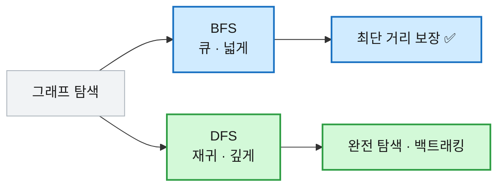

# [알고리즘] BFS · DFS — 이럴 땐 이거 쓴다

## 1. BFS·DFS를 정리하는 이유

그래프 문제의 절반은 결국 "어떻게 빠짐없이 훑느냐"로 귀결된다. 미로에서 출구까지 최소 몇 칸인지, 섬이 몇 개인지, 특정 노드에 도달할 수 있는지 — 전부 그래프를 탐색하는 문제다. 그리고 탐색 방법은 사실상 둘뿐이다. 넓게 퍼지는 BFS, 깊게 파고드는 DFS.

이 둘은 코테 알고리즘의 뿌리다. 최단 경로, 백트래킹, 연결 요소, 위상 정렬이 전부 여기서 갈라져 나온다. 그래서 BFS와 DFS의 뼈대를 손에 익히는 게 우선이다. 뼈대만 잡으면 문제마다 방문 조건과 처리 내용만 갈아 끼우면 된다. 그 뼈대와, 언제 어느 쪽을 고르는지를 정리한다.

## 2. 먼저 알아야 할 세 가지 개념

**① BFS는 큐로 넓게, DFS는 재귀로 깊게 간다.** BFS는 가까운 노드부터 한 겹씩 퍼지고, DFS는 한 길을 끝까지 가본 뒤 되돌아온다. 이 차이가 쓰임새를 가른다.

```
     1
    / \
   2   3
  /|   |
 4 5   6

BFS 방문 순서: 1 → 2 → 3 → 4 → 5 → 6   (가까운 층부터)
DFS 방문 순서: 1 → 2 → 4 → 5 → 3 → 6   (한 길 끝까지 판 뒤 복귀)
```

**② 방문 배열이 없으면 무한 루프에 빠진다.** 그래프엔 사이클이 흔해서, 방문한 노드를 다시 넣으면 영원히 끝나지 않는다. `visited`로 한 번 본 노드는 거른다.

**③ BFS는 가중치 없는 그래프에서 최단 거리를 보장한다.** 가까운 층부터 퍼지므로 어떤 노드에 처음 닿는 순간이 곧 최단 거리다. DFS는 이 보장이 없다(깊이부터 파고들어 먼 길로 먼저 닿을 수 있다).



## 3. 그래프 표현 — 대부분 인접 리스트

정점마다 "이어진 이웃 목록"을 들고 있는 인접 리스트가 표준이다. 간선이 성길 때 메모리도 아끼고 순회도 빠르다.

```java
// ── 인접 리스트 (권장) ──
int n = 5;
List<List<Integer>> graph = new ArrayList<>();
for (int i = 0; i <= n; i++) graph.add(new ArrayList<>());
graph.get(1).add(2); graph.get(2).add(1);   // 1-2 양방향 간선
graph.get(1).add(3); graph.get(3).add(1);   // 1-3
// graph.get(1) = [2, 3]  → 1의 이웃은 2와 3

// ── 가중치 있는 인접 리스트 ──
List<List<int[]>> wGraph = new ArrayList<>();
for (int i = 0; i <= n; i++) wGraph.add(new ArrayList<>());
wGraph.get(1).add(new int[]{2, 5});   // 1→2, 가중치 5

// ── 인접 행렬 (노드 적을 때, N ≤ 1000) ──
int[][] adj = new int[n + 1][n + 1];
adj[1][2] = 1; adj[2][1] = 1;         // 1-2 연결을 1로 표시
```

> 💡 정점 번호가 1부터면 배열 크기를 `n + 1`로 잡아 인덱스를 그대로 쓴다. 0번을 비워두는 게 헷갈림을 줄인다.

## 4. BFS — 큐로 넓게

시작 노드를 큐에 넣고 꺼내면서 이웃을 큐에 채운다. 방문 표시는 **큐에 넣는 순간** 한다(꺼낼 때 하면 같은 노드가 중복으로 들어간다).

```java
void bfs(int start) {
    boolean[] visited = new boolean[n + 1];
    Queue<Integer> q = new LinkedList<>();
    q.offer(start);
    visited[start] = true;            // 넣을 때 방문 표시

    while (!q.isEmpty()) {
        int cur = q.poll();
        System.out.print(cur + " ");  // 방문 처리
        for (int next : graph.get(cur)) {
            if (!visited[next]) {
                visited[next] = true; // 여기서도 넣기 직전에 표시
                q.offer(next);
            }
        }
    }
}
```

BFS의 진짜 쓸모는 **최단 거리**다. 방문 여부 대신 `dist` 배열을 쓰면 처음 닿는 순간의 값이 곧 최단 거리다.

```java
int[] dist = new int[n + 1];
Arrays.fill(dist, -1);      // -1 = 미방문
dist[start] = 0;
Queue<Integer> q = new LinkedList<>();
q.offer(start);
while (!q.isEmpty()) {
    int cur = q.poll();
    for (int next : graph.get(cur)) {
        if (dist[next] == -1) {           // 아직 안 닿은 노드만
            dist[next] = dist[cur] + 1;   // 부모 거리 + 1
            q.offer(next);
        }
    }
}
```

`dist[next] == -1` 검사가 방문 배열 역할까지 겸한다. `-1`이 아니면 이미 더 짧은(또는 같은) 거리로 닿았다는 뜻이라 다시 볼 필요가 없다.

## 5. DFS — 재귀로 깊게

현재 노드를 방문 처리하고 안 가본 이웃으로 재귀 호출한다. 코드가 짧아 완전 탐색에 편하다.

```java
boolean[] visited = new boolean[n + 1];

void dfs(int cur) {
    visited[cur] = true;
    System.out.print(cur + " ");
    for (int next : graph.get(cur)) {
        if (!visited[next]) dfs(next);   // 안 가본 이웃으로 파고듦
    }
}
```

> ⚠️ 재귀 DFS는 깊이가 깊으면 스택 오버플로가 난다. 정점이 수십만 개로 한 줄로 길게 이어질 수 있으면, 명시적 스택(`Deque`)으로 바꾸거나 BFS를 쓴다.

## 6. 어느 쪽을 쓸까 — 상황별 "이럴 땐 이거"

| 이럴 땐 | 이거 | 이유 |
|---|---|---|
| 최소 이동 횟수, 가장 빠른 시간 | **BFS** | 가중치 없을 때 최단 거리 보장 |
| 모든 경우의 수, 경로 탐색 | **DFS** | 한 길 끝까지 파며 완전 탐색 |
| 섬 개수, 연결 요소 세기 | **둘 다 가능** | 안 본 칸에서 시작해 덩어리 하나 다 칠하기 |
| 백트래킹(조합·순열) | **DFS** | 갔다가 되돌아오는 구조가 자연스러움 |
| 깊이가 아주 깊을 수 있음 | **BFS** | 재귀 DFS는 스택 오버플로 위험 |

| 구분 | BFS | DFS |
|---|---|---|
| 자료구조 | 큐 | 재귀(=스택) |
| 최단 거리 보장 | ✅ (가중치 없을 때) | ❌ |
| 메모리 | 큐에 층 전체 → 많음 | 경로 깊이만 → 적음 |
| 대표 용도 | 최단 거리·레벨 | 완전 탐색·백트래킹 |

## 7. 빈출 패턴 모음

### 2차원 그리드 BFS — 미로 최단 거리

격자는 상하좌우 이동을 `dx`/`dy` 배열로 처리한다. 좌표를 `int[]{x, y}`로 큐에 담는다.

```java
int[] dx = {-1, 1, 0, 0};   // 상, 하
int[] dy = {0, 0, -1, 1};   // 좌, 우

int bfs2D(int[][] grid, int sx, int sy, int ex, int ey) {
    int R = grid.length, C = grid[0].length;
    int[][] dist = new int[R][C];
    for (int[] row : dist) Arrays.fill(row, -1);
    Queue<int[]> q = new LinkedList<>();
    q.offer(new int[]{sx, sy});
    dist[sx][sy] = 0;

    while (!q.isEmpty()) {
        int[] c = q.poll();
        if (c[0] == ex && c[1] == ey) return dist[ex][ey];   // 도착
        for (int d = 0; d < 4; d++) {
            int nx = c[0] + dx[d], ny = c[1] + dy[d];
            if (nx >= 0 && nx < R && ny >= 0 && ny < C     // 격자 안
                    && dist[nx][ny] == -1 && grid[nx][ny] == 0) {  // 미방문 & 길
                dist[nx][ny] = dist[c[0]][c[1]] + 1;
                q.offer(new int[]{nx, ny});
            }
        }
    }
    return -1;   // 도달 불가
}
```

경계 검사 4개(`nx>=0 && nx<R && ny>=0 && ny<C`)를 빠뜨리면 배열 밖을 찔러 예외가 난다. 그리드 BFS의 단골 실수다.

### 섬 개수 — 연결 요소 세기

`1`(육지)을 발견할 때마다 탐색으로 그 덩어리를 통째로 방문 처리하고, 시작한 횟수를 센다.

```java
int countIslands(int[][] grid) {
    int R = grid.length, C = grid[0].length;
    boolean[][] visited = new boolean[R][C];
    int count = 0;
    for (int i = 0; i < R; i++) {
        for (int j = 0; j < C; j++) {
            if (grid[i][j] == 1 && !visited[i][j]) {
                dfsFill(grid, visited, i, j);   // 덩어리 하나 전부 칠함
                count++;                         // 새 섬 하나 발견
            }
        }
    }
    return count;
}
```

예를 들어 아래 격자면 섬은 3개다.
```
1 1 0 0
1 0 0 1     → 왼쪽 위 L자 덩어리(1), 오른쪽 위 1칸(2),
0 0 1 0        가운데 아래 1칸(3) = 3개
```

### 섬 면적 — DFS로 칸 수 세기

방문하면서 `1`을 반환·누적하면 덩어리 크기가 나온다.

```java
int dfsArea(int[][] grid, boolean[][] visited, int x, int y) {
    int R = grid.length, C = grid[0].length;
    visited[x][y] = true;
    int area = 1;                         // 자기 칸
    int[] dx = {-1, 1, 0, 0}, dy = {0, 0, -1, 1};
    for (int d = 0; d < 4; d++) {
        int nx = x + dx[d], ny = y + dy[d];
        if (nx >= 0 && nx < R && ny >= 0 && ny < C
                && !visited[nx][ny] && grid[nx][ny] == 1) {
            area += dfsArea(grid, visited, nx, ny);   // 이웃 육지 넓이 누적
        }
    }
    return area;
}
```

## 8. 자주 틀리는 지점 정리 ⚠️

| 함정 | 설명 |
|---|---|
| 방문 표시 시점 | BFS는 **큐에 넣을 때** 표시. 꺼낼 때 하면 중복 삽입 |
| 방문 배열 누락 | 사이클에서 무한 루프. `visited` 또는 `dist != -1`로 거름 |
| 그리드 경계 검사 | `0 ≤ nx < R`, `0 ≤ ny < C` 4개 다 확인 (빠지면 예외) |
| DFS 스택 오버플로 | 깊이 크면 재귀 터짐 → 명시적 스택 또는 BFS |
| DFS로 최단 거리 | DFS는 최단 보장 없음. 최단은 BFS |
| `dx`/`dy` 짝 | 방향 배열의 x·y 순서를 맞춰야 함 (엇갈리면 대각선 이동) |

## 9. 정리

- 탐색은 둘 — 큐로 넓게 퍼지는 **BFS**, 재귀로 깊게 파는 **DFS**.
- 방문 표시는 **넣을 때**, 방문 배열이 없으면 사이클에서 무한 루프.
- 가중치 없는 **최단 거리는 BFS**, 완전 탐색·백트래킹은 DFS.
- 그리드는 `dx`/`dy`로 상하좌우를 돌리고, 경계 검사 4개를 잊지 않는다.

