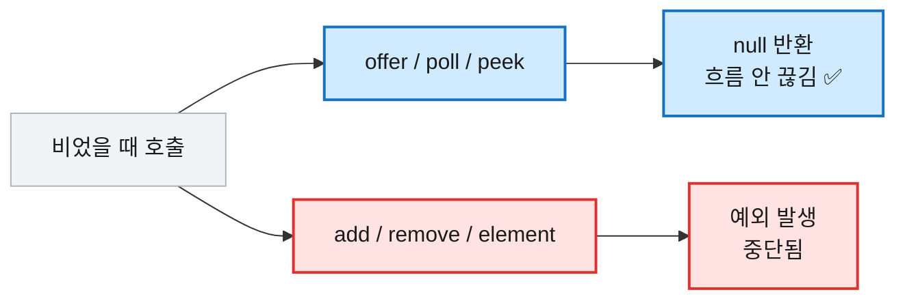

# [자료구조] Queue · Stack · Deque · PriorityQueue — 이럴 땐 이거 쓴다

## 1. 이 네 가지를 묶어 정리하는 이유

이 넷은 전부 "원소를 **어떤 순서로 꺼내느냐**"만 다른 형제다. 먼저 넣은 걸 먼저 꺼내면 Queue(FIFO), 나중 것을 먼저 꺼내면 Stack(LIFO), 양쪽 다 되면 Deque, 항상 최솟·최댓값부터 꺼내면 PriorityQueue다.

그리고 코테에서 어떤 자료구조를 고르느냐가 곧 풀이의 뼈대다. BFS는 Queue 없이 못 짜고, 괄호 검사는 Stack이 정석이며, 다익스트라는 PriorityQueue가 핵심이다. 문제의 요구를 보고 "이건 무슨 순서로 꺼내야 하지?"에 바로 답할 수 있어야 한다. 그래서 넷을 한자리에 놓고, 꺼내는 순서·메소드·함정을 비교하며 정리한다.

## 2. 먼저 알아야 할 두 가지 개념

네 자료구조의 동작과 실수를 가르는 공통 개념 두 가지다.

**① 꺼내는 순서가 자료구조의 정체다.** 같은 값을 넣어도 꺼내는 순서가 다르다.

```java
// 1, 2, 3 순으로 넣었을 때 꺼내는 순서
Queue        : 1 → 2 → 3   (FIFO, 넣은 순)
Stack        : 3 → 2 → 1   (LIFO, 역순)
PriorityQueue: 1 → 2 → 3   (값 작은 순, 넣은 순서 무관)
```

**② `offer/poll/peek`(null 반환) vs `add/remove/element`(예외).** 같은 동작에 두 계열의 메소드가 있다. 비었을 때 한쪽은 `null`을 주고, 다른 쪽은 예외를 던진다. 코테에선 흐름이 끊기지 않는 **`offer/poll/peek`를 표준으로** 쓴다.

```java
Queue<Integer> q = new LinkedList<>();
q.poll();      // null   (비었어도 조용히 null)
q.remove();    // ❌ NoSuchElementException (비었으면 예외)
q.peek();      // null   (비었으면 null)
q.element();   // ❌ 예외
```



## 3. 자료구조 선택 — 상황별 "이럴 땐 이거"

| 이럴 땐 (요구 키워드) | 이거 | 꺼내는 순서 |
|---|---|---|
| BFS, 순서대로 처리, 시뮬레이션 | **Queue** | 넣은 순 (FIFO) |
| 괄호 검사, 역순 처리, 되돌리기 | **Stack** (=Deque) | 역순 (LIFO) |
| 양쪽 삽입/삭제, 슬라이딩 윈도우 최소/최대 | **Deque** | 양쪽 자유 |
| 항상 최솟값/최댓값부터 | **PriorityQueue** | 값 우선순위 |

대표 문제: Queue → 최단거리·바이러스 전파 / Stack → 올바른 괄호·수식 계산 / Deque → 구간 최솟값·회전 / PQ → 다익스트라·K번째 원소.

## 4. Queue — FIFO, 먼저 넣은 게 먼저

`LinkedList`로 생성한다. BFS의 표준 도구다.

```java
Queue<Integer> q = new LinkedList<>();

// ── 삽입 (뒤로) ──
q.offer(1);      // [1]
q.offer(2);      // [1, 2]
q.offer(3);      // [1, 2, 3]

// ── 조회 (맨 앞, 제거 안 함) ──
q.peek();        // 1     (맨 앞만 봄)

// ── 제거 후 반환 (맨 앞) ──
q.poll();        // 1     → 큐는 [2, 3]
q.poll();        // 2     → 큐는 [3]

// ── 상태 확인 ──
q.size();        // 1
q.isEmpty();     // false
q.contains(3);   // true
```

> 💡 BFS의 뼈대는 항상 같다. "꺼내고 → 이웃을 넣고"의 반복이다.

```java
Queue<Integer> bfs = new LinkedList<>();
boolean[] visited = new boolean[n];
bfs.offer(start);
visited[start] = true;
while (!bfs.isEmpty()) {
    int cur = bfs.poll();              // 맨 앞을 꺼내 처리
    for (int next : graph[cur]) {
        if (!visited[next]) {
            visited[next] = true;      // 넣을 때 방문 표시 (중복 삽입 방지)
            bfs.offer(next);
        }
    }
}
```

아래 그래프(0에서 시작)를 직접 따라가 보면 "가까운 노드부터 퍼지는" FIFO 성질이 보인다.

```
그래프:  0 ─ 1 ─ 3
         │       │
         2 ───── 4

start=0, 인접: 0→[1,2], 1→[0,3], 2→[0,4], 3→[1,4], 4→[2,3]
```
```
초기      큐[0]            방문{0}
poll 0  → 1,2 넣음  큐[1,2]   방문{0,1,2}
poll 1  → 3 넣음    큐[2,3]   방문{0,1,2,3}   (1의 이웃 0은 방문됨 → 스킵)
poll 2  → 4 넣음    큐[3,4]   방문{0,1,2,3,4}
poll 3  → 이웃 1,4 모두 방문됨 → 안 넣음  큐[4]
poll 4  → 이웃 2,3 모두 방문됨 → 안 넣음  큐[]
방문 순서: 0 → 1 → 2 → 3 → 4   (거리 0 → 1 → 2 순으로 확장)
```

## 5. Stack — LIFO, 나중 것이 먼저

> ⚠️ 옛 `Stack` 클래스는 `synchronized`라 느리고 권장되지 않는다. **`Deque`(ArrayDeque)를 스택으로 쓰는 게 표준**이다.

```java
Deque<Integer> stack = new ArrayDeque<>();

// ── 삽입 (맨 위로) ──
stack.push(1);   // [1]
stack.push(2);   // [2, 1]   (위에 쌓임)
stack.push(3);   // [3, 2, 1]

// ── 조회 (맨 위, 제거 안 함) ──
stack.peek();    // 3

// ── 제거 후 반환 (맨 위) ──
stack.pop();     // 3     → [2, 1]
stack.pop();     // 2     → [1]

stack.isEmpty(); // false
stack.size();    // 1
```

`push → pop` 순서를 넣은 순서와 비교해 보면 LIFO가 분명해진다.

```java
// 1, 2, 3 push 후 pop을 세 번
push(1), push(2), push(3);   // 쌓인 상태: [3, 2, 1]
pop();  // 3   (마지막에 넣은 게 먼저)
pop();  // 2
pop();  // 1   (처음 넣은 게 마지막)
```

| 구분 | `Stack` (옛 클래스) | `ArrayDeque` (권장) |
|---|---|---|
| 성능 | 느림 (synchronized) | 빠름 |
| 권장 | ❌ | ✅ |

## 6. Deque — 양쪽이 다 열린 자료구조

`First`(앞)·`Last`(뒤) 메소드로 양쪽을 다룬다. Stack도 Queue도 이걸로 대체된다.

```java
Deque<Integer> dq = new ArrayDeque<>();

// ── 양쪽 삽입 ──
dq.offerLast(2);    // [2]
dq.offerFirst(1);   // [1, 2]      (앞에 끼움)
dq.offerLast(3);    // [1, 2, 3]   (뒤에 붙임)

// ── 양쪽 조회 ──
dq.peekFirst();     // 1
dq.peekLast();      // 3

// ── 양쪽 제거 ──
dq.pollFirst();     // 1   → [2, 3]
dq.pollLast();      // 3   → [2]
```

같은 객체를 스택으로도 큐로도 쓸 수 있다. 메소드 이름의 대응을 외워두면 헷갈리지 않는다.

| 하고 싶은 것 | 스택식 | 큐식 | 덱 본래 이름 |
|---|---|---|---|
| 앞에 넣기 | `push` | — | `offerFirst` |
| 뒤에 넣기 | — | `offer` | `offerLast` |
| 앞에서 빼기 | `pop` | `poll` | `pollFirst` |

같은 1,2,3을 넣어도 **스택식이냐 큐식이냐**에 따라 꺼내는 순서가 갈린다.

```java
// 스택처럼 — push는 앞에 쌓고, pop은 앞에서 뺌 → LIFO
Deque<Integer> asStack = new ArrayDeque<>();
asStack.push(1); asStack.push(2); asStack.push(3);  // [3, 2, 1]
asStack.pop();   // 3
asStack.pop();   // 2   (역순)

// 큐처럼 — offer는 뒤에 붙이고, poll은 앞에서 뺌 → FIFO
Deque<Integer> asQueue = new ArrayDeque<>();
asQueue.offer(1); asQueue.offer(2); asQueue.offer(3); // [1, 2, 3]
asQueue.poll();  // 1
asQueue.poll();  // 2   (넣은 순)
```

> ⚠️ `push`+`poll`처럼 **방향을 섞으면** 안 된다. `push`는 앞에 넣는데 `poll`도 앞에서 빼므로 결국 스택과 같아진다. 한 객체에선 스택식·큐식 중 하나로 일관되게 쓴다.

## 7. PriorityQueue — 항상 최솟값/최댓값부터

넣은 순서와 무관하게, 꺼낼 때 **우선순위가 가장 높은 것**(기본은 최솟값)이 나온다. 내부는 힙이라 삽입·삭제가 O(log n)이다.

```java
// ── 최소 힙 (기본 — 작은 값부터) ──
PriorityQueue<Integer> minHeap = new PriorityQueue<>();
minHeap.offer(3);
minHeap.offer(1);
minHeap.offer(2);
minHeap.peek();   // 1   (최솟값 조회)
minHeap.poll();   // 1   (넣은 순서는 3,1,2였지만 작은 것부터)
minHeap.poll();   // 2
minHeap.poll();   // 3

// ── 최대 힙 (큰 값부터) ──
PriorityQueue<Integer> maxHeap = new PriorityQueue<>(Collections.reverseOrder());
maxHeap.offer(3);
maxHeap.offer(1);
maxHeap.offer(2);
maxHeap.poll();   // 3   (큰 것부터)
```

> ⚠️ `peek`/`poll`은 **최솟(최댓)값 하나만** 보장한다. 내부 배열이 완전 정렬돼 있는 게 아니라서, PQ 전체를 순회하면 정렬 순서가 아니다. 정렬된 순서가 필요하면 `poll`을 반복해 꺼내야 한다.

### 커스텀 정렬 — 객체·다중 조건

`int[]`나 객체를 넣을 땐 비교 기준을 직접 준다. 부호 규칙은 정렬과 같다(음수면 a가 먼저).

```java
// ── int[] 첫 원소 오름차순 ──
PriorityQueue<int[]> pq = new PriorityQueue<>((a, b) -> a[0] - b[0]);
pq.offer(new int[]{3, 10});
pq.offer(new int[]{1, 20});
pq.offer(new int[]{2, 30});
pq.poll();   // [1, 20]   (a[0]=1이 가장 작음)
pq.poll();   // [2, 30]
pq.poll();   // [3, 10]

// ── 다중 조건: 첫 원소 오름차순, 같으면 둘째 내림차순 ──
PriorityQueue<int[]> pq2 = new PriorityQueue<>((a, b) -> {
    if (a[0] != b[0]) return a[0] - b[0];   // ① 첫 원소 오름차순
    return b[1] - a[1];                      // ② 같으면 둘째 내림차순 (b-a)
});
pq2.offer(new int[]{1, 5});
pq2.offer(new int[]{1, 9});   // 첫 원소가 1로 같음 → 둘째로 비교
pq2.offer(new int[]{2, 3});
pq2.poll();   // [1, 9]   (첫 원소 1끼리 → 둘째 큰 9가 먼저)
pq2.poll();   // [1, 5]
pq2.poll();   // [2, 3]   (첫 원소 2는 가장 뒤)

// ── 객체 + Comparator (별도 클래스 없이) ──
// 첫 원소 오름차순, 같으면 둘째 오름차순
PriorityQueue<int[]> pq3 = new PriorityQueue<>(
    Comparator.comparingInt((int[] x) -> x[0])  // 첫 원소 기준
              .thenComparingInt(x -> x[1])       // 같으면 둘째 기준
);
pq3.offer(new int[]{1, 9});
pq3.offer(new int[]{1, 5});
pq3.offer(new int[]{2, 3});
pq3.poll();   // [1, 5]   (첫 원소 1끼리 → 둘째 작은 5가 먼저)
pq3.poll();   // [1, 9]
pq3.poll();   // [2, 3]
```

> 💡 `thenComparingInt`는 람다보다 안전하다. 내부적으로 `Integer.compare`를 써서 **오버플로 걱정이 없고**, 조건이 셋 이상일 때 `.thenComparing(...)`만 이어 붙이면 돼 가독성도 좋다.

> ⚠️ `(a, b) -> a[0] - b[0]`도 값이 크면 정렬과 똑같이 **오버플로** 위험이 있다. 안전하게는 `Integer.compare(a[0], b[0])` 또는 `Comparator.comparingInt`.

## 8. 빈출 패턴 모음

도구들이 실제 문제에서 모이는 형태다. 통째로 익혀두면 빠르다.

### 괄호 검사 — Stack

여는 괄호는 쌓고, 닫는 괄호가 오면 짝이 맞는지 꺼내 확인한다.

```java
String s = "({[]})";
Deque<Character> st = new ArrayDeque<>();
boolean valid = true;
for (char c : s.toCharArray()) {
    if (c == '(' || c == '{' || c == '[') {
        st.push(c);                              // 여는 괄호는 일단 쌓기
    } else {
        if (st.isEmpty()) { valid = false; break; }   // 닫는데 쌓인 게 없으면 실패
        char top = st.pop();
        if (c == ')' && top != '(') { valid = false; break; }
        if (c == '}' && top != '{') { valid = false; break; }
        if (c == ']' && top != '[') { valid = false; break; }
    }
}
valid = valid && st.isEmpty();   // 끝까지 보고 스택도 비어야 진짜 올바름
```

실패하는 경우와 비교해 보면 두 조건이 왜 필요한지 보인다.

```java
"(]"   → '('push 후 ']'에서 top='(' 불일치          → false
"(("   → 끝까지 안 닫힘 → 루프는 통과하나 st 안 비어  → false
"())"  → 두 번째 ')'에서 st가 이미 비어 isEmpty      → false
"()[]" → 짝 맞고 끝에 st 비어 있음                    → true
```

### 모노토닉 스택 — 오른쪽에서 처음 큰 값

각 원소의 오른쪽에서 **처음으로 자신보다 큰 값**의 인덱스를 구한다. 스택엔 "아직 답을 못 찾은 인덱스"만 남는다.

```java
int[] arr = {2, 1, 4, 3};
int[] ans = new int[arr.length];
Arrays.fill(ans, -1);                 // 못 찾으면 -1
Deque<Integer> mono = new ArrayDeque<>();   // 인덱스 저장
for (int i = 0; i < arr.length; i++) {
    while (!mono.isEmpty() && arr[mono.peek()] < arr[i])
        ans[mono.pop()] = i;          // arr[i]가 top들의 '처음 큰 값'
    mono.push(i);
}
// ans = [2, 2, -1, -1]
```

`arr = {2,1,4,3}` 추적:
```
i=0 (2): 스택 빔 → push        스택[0]
i=1 (1): arr[0]=2 < 1? 아니오 → push   스택[0,1]
i=2 (4): arr[1]=1<4 → ans[1]=2, arr[0]=2<4 → ans[0]=2 → push   스택[2]
i=3 (3): arr[2]=4<3? 아니오 → push   스택[2,3]
끝: 스택에 남은 2,3은 답 없음 → ans[2]=ans[3]=-1
ans = [2, 2, -1, -1]
```

### 슬라이딩 윈도우 최솟값 — Deque

크기 `k` 윈도우를 옮기며 각 구간의 최솟값을 O(n)에 구한다. 덱엔 인덱스를 **값 오름차순**으로 유지해, 맨 앞이 항상 최솟값이다.

```java
int[] nums = {1, 3, -1, -3, 5, 3, 6, 7};
int k = 3;
int[] result = new int[nums.length - k + 1];
Deque<Integer> dq = new ArrayDeque<>();   // 인덱스 저장
for (int i = 0; i < nums.length; i++) {
    while (!dq.isEmpty() && dq.peekFirst() < i - k + 1)
        dq.pollFirst();                   // 윈도우를 벗어난 인덱스 앞에서 제거
    while (!dq.isEmpty() && nums[dq.peekLast()] > nums[i])
        dq.pollLast();                    // 새 값보다 큰 뒤쪽 값은 쓸모없어 제거
    dq.offerLast(i);
    if (i >= k - 1) result[i - k + 1] = nums[dq.peekFirst()];   // 맨 앞이 최솟값
}
// result = [-1, -3, -3, -3, 3, 3]
```

`nums={1,3,-1,-3,5,3,6,7}, k=3` 앞부분 추적(덱엔 인덱스, 괄호는 그 값):
```
i=0(1)  큰 값 제거 없음 → 덱[0(1)]
i=1(3)  3>1? 아니오     → 덱[0(1),1(3)]
i=2(-1) 3>-1, 1>-1 둘 다 제거 → 덱[2(-1)]   i≥2: result[0]=nums[2]=-1
i=3(-3) -1>-3 제거            → 덱[3(-3)]   result[1]=nums[3]=-3
i=4(5)  5는 작지 않음 → 덱[3(-3),4(5)]       result[2]=nums[3]=-3
i=5(3)  5>3 제거       → 덱[3(-3),5(3)]      윈도우[2..4] 벗어난 3? 3≥3 유지 → result[3]=nums[3]=-3
...
result = [-1, -3, -3, -3, 3, 3]
```

### 다익스트라 — PriorityQueue

가장 빈출. `int[]{거리, 노드}`를 **거리 오름차순**으로 꺼낸다.

```java
PriorityQueue<int[]> pq = new PriorityQueue<>((a, b) -> a[0] - b[0]); // 거리 짧은 순
pq.offer(new int[]{0, start});      // {거리 0, 시작 노드}
dist[start] = 0;
while (!pq.isEmpty()) {
    int[] cur = pq.poll();          // 가장 가까운 노드를 꺼냄
    int d = cur[0], node = cur[1];
    if (d > dist[node]) continue;   // 이미 더 짧은 경로로 처리됨 → 스킵
    for (int[] e : graph[node]) {   // e = {다음 노드, 가중치}
        if (dist[node] + e[1] < dist[e[0]]) {
            dist[e[0]] = dist[node] + e[1];
            pq.offer(new int[]{dist[e[0]], e[0]});
        }
    }
}
```

아래 그래프(start=0)를 따라가면 PQ가 **항상 가장 가까운 노드부터** 꺼내는 게 보인다.

```
간선: 0→1(4), 0→2(1), 2→1(2), 1→3(1), 2→3(5)
```
```
초기      dist=[0,∞,∞,∞]   PQ{(0,0)}
poll(0,0) → 1:0+4=4, 2:0+1=1 갱신   dist=[0,4,1,∞]  PQ{(1,2),(4,1)}
poll(1,2) → 1:1+2=3<4 갱신, 3:1+5=6 갱신  dist=[0,3,1,6]  PQ{(3,1),(4,1),(6,3)}
poll(3,1) → 3:3+1=4<6 갱신          dist=[0,3,1,4]  PQ{(4,1),(6,3),(4,3)}
poll(4,1) → d=4 > dist[1]=3 → 스킵   (낡은 항목)
poll(4,3) → 3 이웃 없음             dist 변화 없음
최종 dist = [0, 3, 1, 4]   (0→2→1 경로로 1까지 3, 0→2→1→3으로 3까지 4)
```

> ⚠️ `if (d > dist[node]) continue;`가 없으면 위의 낡은 `(4,1)` 같은 항목까지 다시 처리해 시간이 폭증한다. PQ에는 갱신될 때마다 중복 삽입되므로 **꺼낸 거리가 최신보다 크면 버리는** 이 한 줄이 필수다.

## 9. 자주 틀리는 지점 정리 ⚠️

| 함정 | 설명 |
|---|---|
| `add`/`remove` 예외 | 비면 예외 → 코테는 `offer`/`poll`/`peek`(null 반환) 표준 |
| 옛 `Stack` 클래스 | 느림(synchronized) → `Deque`(ArrayDeque)를 스택으로 |
| `ArrayDeque`에 `null` | null 저장 금지 → 넣으면 예외 (LinkedList는 허용) |
| PQ 전체 순회 | 정렬된 순서 아님. 정렬 순서는 `poll` 반복으로만 |
| PQ 비교자 오버플로 | `a[0]-b[0]` 큰 값 위험 → `Integer.compare` |
| BFS 방문 표시 시점 | `poll`이 아니라 `offer`할 때 표시해야 중복 삽입 안 됨 |
| `peek`/`poll` 혼동 | `peek`은 보기만, `poll`은 꺼내며 제거 |

## 10. 정리

- 넷의 차이는 **꺼내는 순서** 하나다 — FIFO(Queue), LIFO(Stack), 양쪽(Deque), 우선순위(PQ).
- 비었을 때 안전한 `offer`/`poll`/`peek`를 표준으로, 스택은 `ArrayDeque`로 쓴다.
- BFS는 Queue, 괄호·모노토닉은 Stack, 슬라이딩 윈도우는 Deque, 다익스트라는 PriorityQueue.
- PQ 커스텀 정렬은 정렬과 같은 부호 규칙 — 큰 값엔 `Integer.compare`로 오버플로를 막는다.

