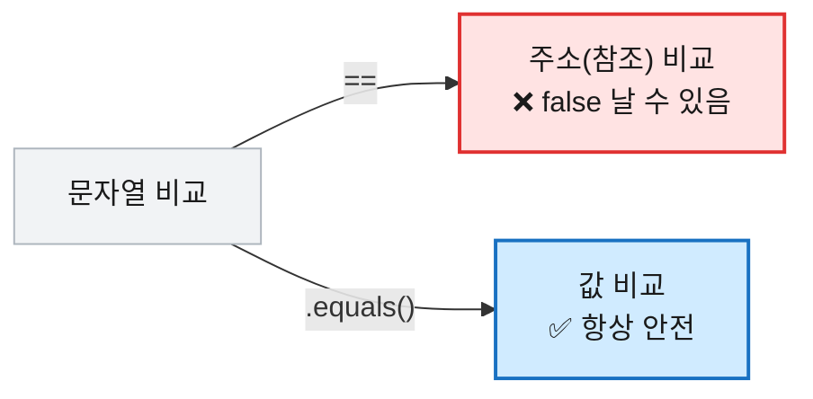
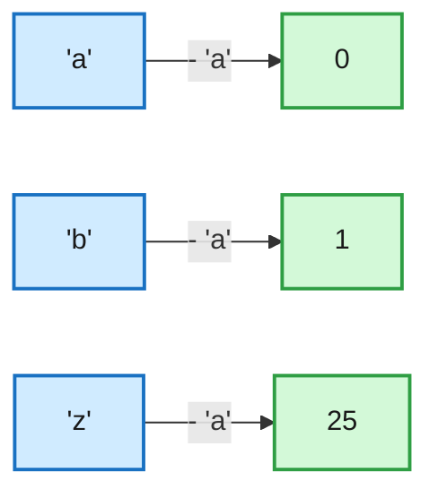

# [String] 코딩테스트 자바 문자열 총정리 — 이럴 땐 이거 쓴다

## 1. String을 가장 먼저 정리하는 이유

코딩테스트는 입력을 문자열로 받는 경우가 대부분이다. `"3 5 7"`처럼 한 줄로 들어온 값을 숫자 셋으로 나누고, `'7'`이라는 글자를 숫자 `7`로 바꾸고, `"apple"`에서 `p`가 몇 번 나오는지 세는 일이 풀이의 출발점이 된다.

이 잔손질이 막히면 그래프든 DP든 시작도 못 한다. 반대로 문자열 메소드가 손에 붙어 있으면 입력 처리에 시간을 거의 쓰지 않는다. 그래서 알고리즘보다 먼저 정리해 둘 가치가 있다.

가변 문자열(`StringBuilder`)과 입력 파싱(`StringTokenizer`)은 성격이 달라 다음 글에서 다룬다.

## 2. 먼저 알아야 할 두 가지 개념

자바 문자열의 동작을 가르는 핵심 개념 두 가지다.

**① String은 불변(immutable)이다.** 한 번 만든 문자열은 바꿀 수 없다. `replace`, `toUpperCase` 같은 메소드는 원본을 고치는 게 아니라 **새 문자열을 반환**한다.

```java
String s = "apple";
s.toUpperCase();          // 반환만 할 뿐 s는 그대로 "apple"
s = s.toUpperCase();      // 반환값을 다시 받아야 "APPLE"
```

**② char는 사실상 숫자다.** 자바의 `char`는 유니코드 값을 담는 정수형이라 **산술 연산**이 된다. 코테에서 가장 자주 쓰는 트릭이다.

```java
'a' + 1;     // 98  (int로 승격됨)
'b' - 'a';   // 1
```

## 3. 상황별 정리 — "이럴 땐 이거"

가장 자주 마주치는 작업을 목적별로 묶었다.

### 길이 · 비었는지 확인

```java
"apple".length();    // 5
"".length();         // 0

"apple".isEmpty();   // false  (길이가 1 이상)
"".isEmpty();        // true   (길이가 0)
" ".isEmpty();       // false  (공백도 길이 1 → 비지 않음)

" ".isBlank();       // true   (공백뿐이어도 true, Java 11+)
"".isBlank();        // true
"a".isBlank();       // false  (글자가 있으면 false)
```

| 이럴 땐 | 이거 |
|---|---|
| 길이가 0인지 | `isEmpty()` |
| 공백만 있는지까지 | `isBlank()` |

### 글자 · 위치 찾기

```java
"apple".charAt(0);        // 'a'   (첫 글자)
"apple".charAt(4);        // 'e'   (마지막 글자)

"apple".indexOf("p");     // 1     (처음 나오는 위치)
"apple".indexOf("p", 2);  // 2     (인덱스 2부터 탐색)
"apple".indexOf("z");     // -1    (없으면 -1)

"apple".lastIndexOf("p"); // 2     (마지막 위치)
"apple".lastIndexOf("z"); // -1    (없으면 -1)

"apple".contains("pp");   // true
"apple".contains("z");    // false
"apple".startsWith("ap"); // true
"apple".startsWith("pp"); // false (맨 앞이 아니면 false)
"apple".endsWith("le");   // true
"apple".endsWith("ap");   // false
```

| 이럴 땐 | 이거 |
|---|---|
| 특정 위치 글자 | `charAt(i)` |
| 처음 나오는 위치 | `indexOf(x)` |
| 마지막 위치 | `lastIndexOf(x)` |
| 포함 여부만 | `contains(x)` 또는 `indexOf(x) != -1` |

### 자르기

```java
"apple".substring(0, 3);  // "app"    (0,1,2 — 끝 인덱스 3 제외)
"apple".substring(3);     // "le"     (3부터 끝까지)
"apple".substring(0);     // "apple"  (0부터 = 전체)
"apple".substring(5);     // ""       (시작==길이 → 빈 문자열)
"apple".substring(2, 2);  // ""       (시작==끝 → 빈 문자열)
```

> ⚠️ `substring(a, b)`는 `a` 이상 `b` **미만**이다. 끝 인덱스는 포함되지 않는다.

### 나누기 (split)

```java
"a b c".split(" ");     // ["a", "b", "c"]
"a,b,,c".split(",");    // ["a", "b", "", "c"]   (사이 빈 값은 포함)
"a,b,,".split(",");     // ["a", "b"]            (뒤쪽 빈 값은 잘림!)
"apple".split("");      // ["", "a","p","p","l","e"]  (맨 앞 "" 주의)
```

| 이럴 땐 | 이거 |
|---|---|
| 공백/쉼표로 나누기 | `split(" ")`, `split(",")` |
| 연속 공백으로 나누기 | `split("\\s+")` |
| 한 글자씩 다루기 | `split("")` 대신 **`toCharArray()`** 권장 |

### 바꾸기 (replace 계열)

```java
"apple".replace("p", "b");          // "abble"  (일치하는 거 전부)
"apple".replace('p', 'b');          // "abble"  (char 버전도 있음)
"apple".replace("z", "b");          // "apple"  (없으면 원본 그대로)
"apple".replaceFirst("p", "b");     // "abple"  (처음 하나만, 정규식)
"apple".replaceAll("[aeiou]", "*"); // "*ppl*"  (정규식)
```

> ⚠️ `replace`는 **일반 문자열**, `replaceAll`/`replaceFirst`는 **정규식**을 받는다. `replaceAll(".", "x")`는 "점만 바꾸기"가 아니라 "모든 글자를 x로" 바꾼다(`.`은 임의의 한 문자). 단순 치환이면 `replace`.

### 공백 제거

```java
"  hi  ".trim();           // "hi"
"  hi  ".strip();          // "hi"     (유니코드 공백까지, Java 11+)
"  hi  ".stripLeading();   // "hi  "   (앞만)
"  hi  ".stripTrailing();  // "  hi"   (뒤만)
```

### 비교

```java
"apple".equals("apple");           // true   (값이 같음)
"apple".equals("Apple");           // false  (대소문자 구분)
"apple".equals("apply");           // false  (한 글자라도 다르면)
"apple".equalsIgnoreCase("APPLE"); // true   (대소문자 무시)
```

`compareTo`는 **같을 때(0)** 와 **다를 때(0이 아닌 값)** 두 경우로 갈린다.

```java
"apple".compareTo("apple");   //  0    (같으면 0)
"apple".compareTo("banana");  // 음수   (사전순 앞 → 0보다 작음)
"banana".compareTo("apple");  // 양수   (사전순 뒤 → 0보다 큼)
```

| 결과 | 의미 |
|---|---|
| `== 0` | 두 문자열이 같다 |
| `< 0` | 기준이 사전순 **앞** |
| `> 0` | 기준이 사전순 **뒤** |

> ⚠️ 문자열 비교는 반드시 `equals`. `==`는 값이 아니라 **주소**를 비교해 같은 글자여도 `false`가 날 수 있다.



### 숫자 ↔ 문자열 변환

```java
Integer.parseInt("100");     // 100        (String → int)
Integer.parseInt("-7");      // -7         (부호도 파싱)
Integer.parseInt("ff", 16);  // 255        (16진수 파싱)
Integer.parseInt("12a");     // ❌ NumberFormatException (숫자 아닌 글자)
Integer.toString(100);       // "100"      (int → String)
String.valueOf(3.14);        // "3.14"     (어떤 타입이든 → String)
```

| 이럴 땐 | 이거 |
|---|---|
| 문자열 → 정수 | `Integer.parseInt(s)` |
| n진수 문자열 → 정수 | `Integer.parseInt(s, n)` |
| 정수 → 문자열 | `String.valueOf(n)` / `n + ""` |

### 합치기 · 반복 · 형식

```java
String.join("-", "a", "b", "c");   // "a-b-c"
String.join("", "a", "b", "c");    // "abc"      (구분자 없이 이어붙이기)
"ab".repeat(3);                    // "ababab"   (Java 11+)
"ab".repeat(0);                    // ""         (0번이면 빈 문자열)
String.format("%05d", 42);         // "00042"    (0으로 채워 5자리)
String.format("%5d", 42);          // "   42"    (공백으로 5자리)
String.format("%.2f", 3.14159);    // "3.14"     (소수 2자리 반올림)
```

## 4. char 다루기 — 코테 핵심 ⭐

`char`가 숫자라는 점을 활용하면, 글자를 **배열 인덱스로 직접** 쓸 수 있다.

```java
(int) 'a';   // 97   (아스키 코드)
(char) 97;   // 'a'
'a' - 'a';   // 0    (알파벳 인덱스: a=0, b=1, ... z=25)
'z' - 'a';   // 25
'7' - '0';   // 7    (숫자 문자 → 정수, parseInt보다 빠름)
```


*글자 → 배열 인덱스. 빈도 세기·정렬의 기본 도구다.*

글자 종류 판별은 `Character`로 한다.

```java
Character.isDigit('3');      // true
Character.isDigit('a');      // false
Character.isLetter('a');     // true
Character.isLetter('3');     // false
Character.isUpperCase('A');  // true
Character.isUpperCase('a');  // false
Character.toUpperCase('a');  // 'A'   (이미 대문자면 그대로)
Character.toLowerCase('A');  // 'a'
```

## 5. 빈출 패턴 모음

위 도구들이 실제 문제에서 모이는 형태다. 통째로 익혀두면 빠르다.

```java
// 팰린드롬 (뒤집어서 같나)
boolean isPalindrome(String s) {
    for (int i = 0, j = s.length() - 1; i < j; i++, j--)
        if (s.charAt(i) != s.charAt(j)) return false;
    return true;
}

// 아나그램 (글자 구성이 같나) — 정렬 후 비교
char[] a = "listen".toCharArray(); Arrays.sort(a);
char[] b = "silent".toCharArray(); Arrays.sort(b);
boolean anagram = Arrays.equals(a, b);   // true

// 글자 빈도 세기 — char 산술 활용
int[] freq = new int[26];
for (char c : "apple".toCharArray())
    freq[c - 'a']++;                     // 'p' → freq[15]++

// char 배열로 바꿔 수정 후 다시 문자열로
char[] arr = "apple".toCharArray();
arr[0] = 'A';
String result = new String(arr);         // "Apple"
```

## 6. 자주 틀리는 지점 정리 ⚠️

| 함정 | 설명 |
|---|---|
| `==` 로 비교 | 주소 비교다. 값 비교는 `equals()` |
| `substring(a, b)` 범위 | `b`는 **미포함** (a 이상 b 미만) |
| `split("")` | 결과 맨 앞에 빈 문자열 `""`이 붙는다 |
| `replaceAll` 의 인자 | 일반 문자열이 아니라 **정규식**이다 |
| String 메소드가 안 먹는 듯 | 불변이라 **반환값을 다시 받아야** 적용된다 |
| `toLowerCase()` 로케일 | 글자를 인덱스로 다룰 땐 `toLowerCase(Locale.ROOT)`가 안전 |

## 7. 정리

- String은 **불변** — 변환 메소드는 새 문자열을 반환하므로 반환값을 다시 받는다.
- `char`는 **숫자** — `c - 'a'`로 글자를 배열 인덱스로 직접 쓴다.
- 비교는 `equals`, 자르기는 끝 인덱스 미포함, `replaceAll`은 정규식 — 이 셋이 단골 실수다.
- 입력을 빠르게 쪼개고 이어붙이는 건 다음 글 **[StringBuilder / StringTokenizer]** 에서 다룬다.


