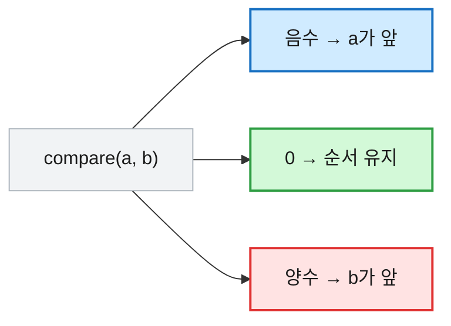

# [배열 · 정렬] Arrays 유틸과 Comparator — 이럴 땐 이거 쓴다

## 1. 배열·정렬을 정리하는 이유

코테에서 입력은 거의 다 배열에 담긴다. 그리고 그 배열을 **정렬해 두면** 그리디·이분탐색·투포인터 같은 알고리즘이 비로소 성립한다. 즉 정렬은 답을 내는 알고리즘이라기보다, 본 알고리즘에 들어가기 전의 **전처리**인 경우가 많다.

문제는 자바 배열에 함정이 많다는 것이다. `==`로 내용 비교가 안 되고, 기본형 `int[]`는 내림차순 정렬이 바로 안 되며, 다중 조건 정렬은 `Comparator`를 직접 써야 한다. 이 함정들을 한 번 정리해 둔다.

## 2. 먼저 알아야 할 세 가지 개념

**① 길이는 `.length` — 괄호가 없다.** 문자열의 `length()`(메소드)와 헷갈리기 쉽다. 배열은 필드라 괄호를 안 붙인다.

```java
int[] arr = {3, 1, 4};
arr.length;        // 3   (괄호 없음)
"abc".length();    // 3   (문자열은 괄호 있음 — 다르다!)
```

**② 기본형(`int[]`)과 래퍼형(`Integer[]`)은 정렬이 다르다.** 내림차순·커스텀 정렬은 `Comparator`가 필요한데, **`Comparator`는 기본형에 못 쓴다.** 그래서 내림차순이 필요하면 `Integer[]`로 박싱하거나, 정렬 후 뒤집어야 한다.

**③ Comparator는 "누가 앞이냐"를 부호로 답한다.** `compare(a, b)`가 **음수면 a가 앞**, 양수면 b가 앞, 0이면 유지. `(a, b) -> a - b`가 오름차순인 이유다.



## 3. 배열 기본

```java
// ── 선언 · 초기화 ──
int[] a = new int[5];          // [0, 0, 0, 0, 0]      (기본값 0)
int[] b = {3, 1, 4, 1, 5};     // 값으로 바로 초기화
boolean[] v = new boolean[3];  // [false, false, false] (기본값 false)
String[] s = new String[3];    // [null, null, null]    (참조형 기본값 null)
int[][] m = new int[3][4];     // 3행 4열, 전부 0

// ── 길이 ──
b.length;        // 5   (원소 수)
m.length;        // 3   (행 수)
m[0].length;     // 4   (열 수)

// ── 향상된 for문 (값만 필요할 때) ──
for (int x : b) System.out.print(x + " ");   // 3 1 4 1 5
```

## 4. Arrays 유틸 — 상황별 "이럴 땐 이거"

### 출력 (디버깅 필수)

```java
Arrays.toString(new int[]{3, 1, 4});             // "[3, 1, 4]"
Arrays.deepToString(new int[][]{ {1,2}, {3,4} }); // "[[1, 2], [3, 4]]" (2차원은 deep)
System.out.println(new int[]{3, 1, 4});          // [I@1b6d3586 ← 그냥 출력하면 주소!
```

### 채우기 · 복사

```java
int[] arr = {0, 0, 0, 0, 0};
Arrays.fill(arr, 7);            // [7, 7, 7, 7, 7]      (전체)
Arrays.fill(arr, 1, 4, -1);    // [7, -1, -1, -1, 7]   (인덱스 1~3만, 4는 제외)

int[] src = {3, 1, 4, 1, 5};
Arrays.copyOf(src, src.length); // [3, 1, 4, 1, 5]   (전체 복사)
Arrays.copyOf(src, 3);          // [3, 1, 4]         (앞 3개)
Arrays.copyOf(src, 7);          // [3,1,4,1,5,0,0]   (길이 늘리면 0으로 채움)
Arrays.copyOfRange(src, 1, 4);  // [1, 4, 1]         (인덱스 1~3, 4 제외)
src.clone();                    // [3, 1, 4, 1, 5]   (1차원은 clone도 가능)
```

### 비교

```java
int[] a = {1, 2, 3}, b = {1, 2, 3};
a == b;                  // false   (주소 비교라 내용 같아도 false!)
Arrays.equals(a, b);     // true    (값 비교)

int[][] m1 = { {1,2} }, m2 = { {1,2} };
Arrays.equals(m1, m2);   // false   (2차원엔 안 통함 — 안쪽이 또 배열)
Arrays.deepEquals(m1, m2); // true  (2차원은 deepEquals)
```

### 이진 탐색 (반드시 정렬 후)

```java
int[] sorted = {1, 2, 3, 4, 5};
Arrays.binarySearch(sorted, 3);   // 2    (값 3의 인덱스)
Arrays.binarySearch(sorted, 6);   // -6   (없으면 음수: -(들어갈 위치)-1)
```

> ⚠️ `binarySearch`는 **정렬된 배열**에서만 맞다. 정렬 안 된 배열에 쓰면 엉뚱한 값이 나온다.

## 5. 정렬 — 상황별 "이럴 땐 이거"

```java
// ── 오름차순 (기본) ──
int[] arr = {3, 1, 4, 1, 5, 9, 2, 6};
Arrays.sort(arr);          // 전:{3,1,4,1,5,9,2,6} → 후:[1, 1, 2, 3, 4, 5, 6, 9]

// ── 구간만 정렬 (from 이상 to 미만) ──
int[] r = {3, 1, 4, 1, 5, 9, 2, 6};
Arrays.sort(r, 2, 6);      // 인덱스 2~5 {4,1,5,9}만 정렬
                           // → [3, 1, 1, 4, 5, 9, 2, 6]  (0,1,6,7 자리는 그대로)

// ── 내림차순 — int[]는 안 되고 Integer[] 필요 ──
Integer[] boxed = {3, 1, 4, 1, 5};
Arrays.sort(boxed, Collections.reverseOrder());  // [5, 4, 3, 1, 1]

// ── 문자열 정렬 ──
String[] s1 = {"banana", "apple", "cherry"};
Arrays.sort(s1);                                   // [apple, banana, cherry] (사전순)
String[] s2 = {"bb", "a", "cccc", "ddd"};
Arrays.sort(s2, (x, y) -> x.length() - y.length()); // [a, bb, ddd, cccc] (길이 짧은 순)

// ── 2차원 배열: 첫 열 기준 오름차순 ──
int[][] pts = { {3,2}, {1,5}, {2,1} };
Arrays.sort(pts, (p, q) -> p[0] - q[0]);
// 전:{ {3,2},{1,5},{2,1} } → 후:[[1,5], [2,1], [3,2]]  (p[0]=1,2,3 순)

// ── 2차원 다중 조건: 1순위 같으면 2순위로 ──
int[][] data = { {2,3}, {1,5}, {2,1}, {1,2} };
Arrays.sort(data, (p, q) -> {
    if (p[0] != q[0]) return p[0] - q[0];   // ① 첫 열 오름차순
    return p[1] - q[1];                      // ② 첫 열이 같으면 둘째 열 오름차순
});
// → [[1,2], [1,5], [2,1], [2,3]]
//    첫 열로 1,1,2,2 묶고 → 같은 1끼리 2,5 / 같은 2끼리 1,3 정렬

// ── 내림차순 다중 조건 (부호만 뒤집기) ──
int[][] desc = { {1,2}, {3,1}, {1,5} };
Arrays.sort(desc, (p, q) -> q[0] - p[0]);   // q-p → 첫 열 내림차순
// → [[3,1], [1,2], [1,5]]
```

> ⚠️ `(a, b) -> a - b`는 값이 아주 클 때(예: 음수 + 큰 양수) **오버플로**로 부호가 뒤집힐 수 있다. 안전하게는 `Integer.compare(a, b)`를 쓴다.

### 스트림으로 통계

```java
int[] nums = {3, 1, 4, 1, 5};
Arrays.stream(nums).sum();                   // 14
Arrays.stream(nums).max().getAsInt();        // 5
Arrays.stream(nums).min().getAsInt();        // 1
Arrays.stream(nums).average().getAsDouble(); // 2.8
Arrays.stream(nums).filter(x -> x > 2).count(); // 3  (2 초과: 3,4,5)
```

## 6. 자주 쓰는 초기화 패턴

```java
// 최단거리 배열 — 큰 값으로 초기화
int[] dist = new int[n];
Arrays.fill(dist, Integer.MAX_VALUE);
dist[0] = 0;

// 2차원은 행마다 fill
int[][] dp = new int[n][m];
for (int[] row : dp) Arrays.fill(row, Integer.MAX_VALUE);

// 방문 배열 (기본값 false라 따로 초기화 불필요)
boolean[] visited = new boolean[n];
boolean[][] visited2D = new boolean[n][m];

// 2차원 전체 출력
for (int[] row : matrix) System.out.println(Arrays.toString(row));
```

## 7. 빈출 패턴 — 좌표 압축

값의 범위가 너무 클 때(예: 10⁹), 실제 값 대신 **상대적 순위(0..N-1)** 만 필요하면 정렬+이진탐색으로 압축한다.

```java
int[] arr = {100, 10, 1000, 50, 100};

// 1) 중복 제거 후 정렬
int[] sorted = Arrays.stream(arr).distinct().sorted().toArray();
// [10, 50, 100, 1000]

// 2-A) 각 값을 "정렬 후 인덱스(순위)"로 변환 — 이진탐색
for (int x : arr)
    System.out.print(Arrays.binarySearch(sorted, x) + " ");  // 2 0 3 1 2
// 100→2, 10→0, 1000→3, 50→1, 100→2

// 2-B) Map에 순위를 미리 담아두면 조회가 O(1) — 반복 조회 많을 때 유리
Map<Integer, Integer> rank = new HashMap<>();
for (int i = 0; i < sorted.length; i++) rank.put(sorted[i], i);  // 10→0,50→1,100→2,1000→3
for (int x : arr)
    System.out.print(rank.get(x) + " ");                 // 2 0 3 1 2
```

## 8. 자주 틀리는 지점 정리 ⚠️

| 함정 | 설명 |
|---|---|
| `arr.length()` | 배열은 `.length` (괄호 없음). 괄호는 String |
| `arr == other` | 주소 비교. 내용은 `Arrays.equals` / 2차원은 `deepEquals` |
| `int[]` 내림차순 | `Comparator`가 안 먹음 → `Integer[]`로 박싱하거나 정렬 후 뒤집기 |
| `(a,b) -> a-b` 오버플로 | 큰 값엔 `Integer.compare(a,b)` |
| `binarySearch` 미정렬 | 정렬 안 된 배열엔 결과가 틀림 |
| `System.out.println(arr)` | 주소(`[I@...`)가 찍힘 → `Arrays.toString(arr)` |
| `copyOfRange(a, l, r)` | `r`은 미포함 (substring과 동일) |

## 9. 정리

- 길이는 `.length`, 비교는 `Arrays.equals`/`deepEquals`, 출력은 `Arrays.toString`.
- 오름차순은 `Arrays.sort`, 내림차순·커스텀은 `Comparator`(음수면 a가 앞) + `Integer[]`.
- 정렬은 그리디·이분탐색의 전처리 — 큰 값 범위는 **좌표 압축**으로 순위만 남긴다.

