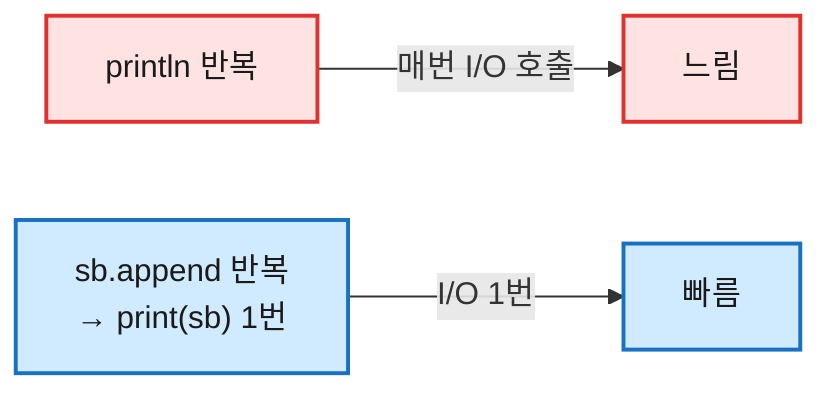

# [입출력] BufferedReader · StringTokenizer · StringBuilder — 코테 입출력 한 세트

## 1. 입출력을 한 번에 정리하는 이유

모든 코테 문제는 입력을 읽고 답을 출력하는 것으로 시작하고 끝난다. 그런데 이 입출력만 잘못 골라도 시간 초과가 난다.

- **입력**: `Scanner`는 편하지만 느려서, 입력이 많으면(N ≥ 10만) 그것만으로 터진다.
- **출력**: 반복문 안에서 `System.out.println`을 매번 부르면 그것도 느리다.

그래서 코테의 표준 조합은 정해져 있다 — **입력은 `BufferedReader` + `StringTokenizer`, 출력은 `StringBuilder`로 모아 한 번에.** 이 셋은 늘 한 세트로 쓰여서 묶어서 정리한다.

## 2. 먼저 알아야 할 개념

**입력과 출력 모두 "한 줄로 모아서" 처리한다.**

- 입력: `BufferedReader`가 **한 줄**을 통째로 읽고, `StringTokenizer`가 그 줄을 **토큰**으로 쪼갠다.
- 출력: 결과를 `StringBuilder`에 **모았다가** 마지막에 한 번 내보낸다.


> ⚠️ `readLine()`도 `nextToken()`도 **String**을 반환한다. 숫자가 필요하면 항상 `Integer.parseInt(...)`로 감싼다.

## 3. 입력 — BufferedReader + StringTokenizer

### 기본 세팅

```java
import java.io.*;
import java.util.*;

public class Main {
    public static void main(String[] args) throws IOException {  // throws 필수
        BufferedReader br = new BufferedReader(new InputStreamReader(System.in));
        // ... 입력 처리 ...
    }
}
```

> ⚠️ `br.readLine()`은 `IOException`을 던질 수 있어, `main`에 `throws IOException`을 붙여야 컴파일된다.

### 상황별 "이럴 땐 이거"

```java
// 정수 하나 — 입력: 5
int n = Integer.parseInt(br.readLine().trim());   // 5  (trim으로 개행 방어)

// 공백으로 구분된 정수 여러 개 — 입력: 3 5 7
StringTokenizer st = new StringTokenizer(br.readLine());
int a = Integer.parseInt(st.nextToken());   // 3
int b = Integer.parseInt(st.nextToken());   // 5
int c = Integer.parseInt(st.nextToken());   // 7

// 정수 배열 — 입력: 1 2 3 4 5
st = new StringTokenizer(br.readLine());
int[] arr = new int[5];
for (int i = 0; i < 5; i++)
    arr[i] = Integer.parseInt(st.nextToken());     // [1,2,3,4,5]
```

```java
// 2차원 배열 (N×M) — 줄마다 ST를 새로 만든다
int[][] map = new int[2][3];
for (int i = 0; i < 2; i++) {
    st = new StringTokenizer(br.readLine());       // ← 줄 바뀔 때마다 새로!
    for (int j = 0; j < 3; j++)
        map[i][j] = Integer.parseInt(st.nextToken());
}

// 문자 그리드 (미로 등) — 공백 없는 줄은 split 불필요
char[][] grid = new char[2][3];
for (int i = 0; i < 2; i++) {
    String row = br.readLine();
    for (int j = 0; j < 3; j++)
        grid[i][j] = row.charAt(j);                // charAt으로 직접 접근
}
```

| 이럴 땐 | 이거 |
|---|---|
| 한 줄 통째로 | `br.readLine()` |
| 공백/구분자로 쪼개기 | `new StringTokenizer(line)` |
| 다음 토큰 | `st.nextToken()` (String!) |
| 공백 없는 문자열 | `split` 없이 `charAt(j)` |

### StringTokenizer 동작 자세히

토큰은 꺼낼 때마다 줄어든다.

```java
StringTokenizer st = new StringTokenizer("10 20 30 40");
st.countTokens();    // 4       (남은 토큰 수)
st.hasMoreTokens();  // true
st.nextToken();      // "10"    (앞에서부터 꺼냄)
st.nextToken();      // "20"
st.countTokens();    // 2       (꺼낸 만큼 줄어듦)

new StringTokenizer("a,b,c", ",");   // 구분자 직접 지정
new StringTokenizer("a,,b", ",");    // "a","b"  (빈 토큰은 무시됨!)
```

개수가 불확실하면 `hasMoreTokens()`로 감싸 순회한다.

```java
StringTokenizer st = new StringTokenizer("10 20 30");
while (st.hasMoreTokens())
    System.out.println(st.nextToken());   // 10, 20, 30
```

## 4. 출력 — StringBuilder로 모아서

반복 출력에서 `println`을 매번 부르면 느리다. 결과를 `StringBuilder`에 모았다가 **마지막에 한 번** 내보낸다.

```java
// ❌ 느림 — 반복마다 출력 호출
for (int i = 1; i <= 5; i++) System.out.println(i);

// ✅ 빠름 — 모아서 한 번에
StringBuilder sb = new StringBuilder();
for (int i = 1; i <= 5; i++) sb.append(i).append('\n');
System.out.print(sb);                 // 1\n2\n3\n4\n5\n
```



### append와 편집 메소드

```java
StringBuilder sb = new StringBuilder();
sb.append("Hello").append(' ').append(123);  // "Hello 123" (체이닝, 어떤 타입이든)

new StringBuilder("apple").insert(2, "XX");   // "apXXple"  (인덱스 2 앞에 삽입)
new StringBuilder("apple").delete(1, 3);      // "ale"      (1 이상 3 미만 삭제)
new StringBuilder("apple").deleteCharAt(0);   // "pple"     (한 글자 삭제)
new StringBuilder("apple").setCharAt(0, 'A'); // "Apple"    (한 글자만 변경)
new StringBuilder("apple").reverse();         // "elppa"    (역순 출력·팰린드롬)
```

| 이럴 땐 | 이거 |
|---|---|
| 끝에 붙이기 | `append(x)` |
| 중간 삽입 | `insert(i, x)` |
| 구간/한 글자 삭제 | `delete(a,b)` / `deleteCharAt(i)` |
| 한 글자만 변경 | `setCharAt(i, c)` |
| 뒤집기 | `reverse()` |

끝에 남는 구분자는 떼어낸다.

```java
StringBuilder sb = new StringBuilder();
for (int n : new int[]{1, 2, 3, 4, 5}) sb.append(n).append(',');
sb.deleteCharAt(sb.length() - 1);     // 끝의 ',' 제거 → "1,2,3,4,5"
```

> ⚠️ `StringBuilder`끼리 `equals`로 비교하면 내용이 같아도 **항상 false**(주소 비교)다. 내용 비교는 `sb.toString().equals(...)`.

## 5. 다른 입출력 방법과 비교

| 방법 | 속도 | 이럴 땐 |
|---|---|---|
| `Scanner` | 느림 | 입력 적고 간단할 때 (`nextInt()` 편함) |
| **`BufferedReader` + `StringTokenizer`** | 빠름 | **대부분의 코테** ✅ |
| `StreamTokenizer` | 가장 빠름 | 숫자만 들어오고 극한 최적화 필요할 때 |
| `System.out.println` 반복 | 느림 | 출력이 적을 때만 |
| **`StringBuilder` + `print`** | 빠름 | **반복 출력** ✅ |
| `BufferedWriter` | 가장 빠름 | `flush()` 필수, 극한 최적화 |

> ⚠️ `Scanner`에서 `nextInt()` 직후 `nextLine()`을 부르면, 버퍼에 남은 개행(`\n`)이 먼저 읽혀 빈 줄이 잡힌다. `BufferedReader`는 항상 줄 단위라 이 함정이 없다.

## 6. 코테 기본 템플릿

입력(BR+ST)과 출력(SB)을 합친, 거의 모든 문제의 출발점이다. 통째로 외워두면 어떤 문제든 같은 골격으로 시작한다.

```java
import java.io.*;
import java.util.*;

public class Main {
    public static void main(String[] args) throws IOException {
        BufferedReader br = new BufferedReader(new InputStreamReader(System.in));
        StringBuilder sb = new StringBuilder();

        int T = Integer.parseInt(br.readLine().trim());   // 테스트 케이스 수
        while (T-- > 0) {
            StringTokenizer st = new StringTokenizer(br.readLine());
            int a = Integer.parseInt(st.nextToken());
            int b = Integer.parseInt(st.nextToken());
            sb.append(a + b).append('\n');                // 결과는 모아둔다
        }
        System.out.print(sb);                             // 마지막에 한 번에 출력
    }
}
```

## 7. 자주 틀리는 지점 정리 ⚠️

| 함정 | 설명 |
|---|---|
| `throws IOException` 누락 | `readLine()`은 예외를 던져 컴파일 안 됨 |
| `nextToken()` 타입 | String이다. 숫자는 `Integer.parseInt`로 감싸기 |
| 줄마다 ST 재생성 | 줄이 바뀌면 `StringTokenizer`를 새로 만들기 |
| 토큰 없는데 `nextToken()` | `NoSuchElementException` → `hasMoreTokens()` 확인 |
| 반복문에서 `String +` | O(n²) → 느림. 출력은 `StringBuilder`로 모으기 |
| `sb.equals(other)` | 내용 비교 안 됨(주소 비교). `sb.toString().equals(...)` |
| `BufferedWriter` | `flush()` 안 하면 출력이 안 나간다 |

## 8. 정리

- 입력은 **`BufferedReader`로 한 줄 → `StringTokenizer`로 토큰 → `parseInt`**, 출력은 **`StringBuilder`에 모아 `print` 한 번**.
- 줄이 바뀌면 `StringTokenizer`를 새로 만들고, `main`엔 `throws IOException`.
- **BR + ST + StringBuilder** 템플릿 하나면 모든 문제의 입출력 골격이 끝난다.

