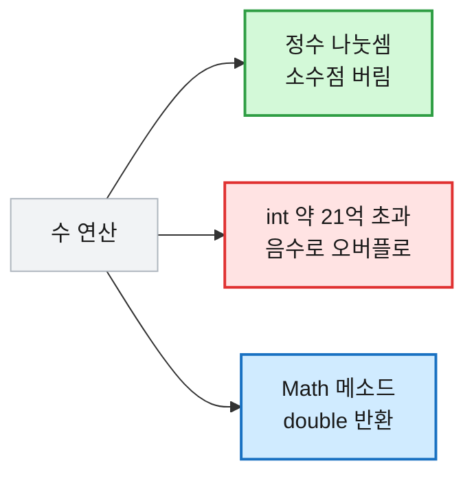

# [수학] 코딩테스트 자바 수학 총정리 — 이럴 땐 이거 쓴다

## 1. 수학을 정리하는 이유

코테에서 수학은 "수학 문제"로만 나오지 않는다. 거리·횟수·주기·자릿수처럼 거의 모든 문제 안에 숨어 있다. 올림 나눗셈으로 페이지 수를 구하고, 최소공배수로 두 신호가 다시 겹치는 시점을 구하고, 소수 판별로 후보를 거르는 식이다.

그런데 자바의 수 연산에는 함정이 많다. `int`는 약 21억에서 넘쳐버리고(오버플로), 정수 나눗셈은 소수점을 그냥 버리며, `Math` 메소드는 대부분 `double`을 돌려줘 캐스팅이 필요하다. 이 함정들을 모르면 "로직은 맞는데 답이 틀리는" 상황에 빠진다. 그래서 자주 쓰는 수학 도구와 그 함정을 한 번에 정리해 둔다.

## 2. 먼저 알아야 할 세 가지 개념

수 연산의 결과를 가르는 핵심 개념 세 가지다.

**① 정수 나눗셈은 소수점을 버린다(내림 아님, 버림).** `7 / 2`는 `3.5`가 아니라 `3`이다. 0 방향으로 잘라낸다.

```java
7 / 2;     // 3   (3.5 → 소수점 버림)
-7 / 2;    // -3  (-3.5 → 0 방향으로 버림, 내림이면 -4)
7.0 / 2;   // 3.5 (한쪽이 실수면 실수 나눗셈)
```

**② int는 약 21억에서 넘친다.** `Integer.MAX_VALUE`(약 21억)를 넘으면 음수로 뒤집힌다. 곱셈·합산은 특히 위험하다.

```java
int a = 2_000_000_000;
a + a;            // -294967296  (❌ 약 40억 → 오버플로)
(long) a + a;     // 4000000000  (✅ long으로 먼저 올림)
```

**③ Math 메소드는 대부분 double을 반환한다.** `Math.pow`, `Math.sqrt`, `Math.ceil`은 전부 `double`이다. 정수로 쓰려면 캐스팅해야 하고, 이때 부동소수점 오차가 끼어들 수 있다.

```java
Math.pow(2, 10);        // 1024.0  (double)
(int) Math.pow(2, 10);  // 1024    (캐스팅 필요)
Math.sqrt(16);          // 4.0     (double)
```



## 3. Math 클래스 — 상황별 "이럴 땐 이거"

### 최대 · 최소 · 절댓값

```java
Math.max(3, 7);      // 7
Math.max(-1, -5);    // -1   (음수끼리도 큰 쪽)
Math.min(3, 7);      // 3
Math.min(-1, -5);    // -5

Math.abs(-5);        // 5
Math.abs(5);         // 5    (양수는 그대로)
Math.abs(-3.14);     // 3.14 (실수도 가능)
Math.abs(0);         // 0
```

> ⚠️ `Math.abs(Integer.MIN_VALUE)`는 여전히 음수(`-2147483648`)다. `MIN_VALUE`는 짝이 되는 양수가 없어 오버플로한다. 극단값을 다룰 땐 `long`으로.

### 거듭제곱 · 제곱근

```java
Math.pow(2, 10);       // 1024.0  (double 반환)
(int) Math.pow(2, 10); // 1024    (int로 쓰려면 캐스팅)
Math.pow(2, 0);        // 1.0     (0제곱은 1)

Math.sqrt(16);         // 4.0
Math.sqrt(2);          // 1.4142135623730951
Math.sqrt(0);          // 0.0
```

> ⚠️ `(int) Math.pow(...)`는 부동소수점 오차로 `999.9999`가 나와 `int` 캐스팅 시 `999`가 될 수 있다. 정확한 정수 거듭제곱이 필요하면 반복 곱(`for`)을 쓰는 게 안전하다.

### 올림 · 내림 · 반올림

세 메소드의 **음수 처리**가 특히 헷갈린다. 양수·음수를 나란히 본다.

```java
Math.ceil(3.1);    // 4.0   (올림)
Math.ceil(3.9);    // 4.0
Math.ceil(-3.1);   // -3.0  ⚠️ 음수 올림은 0에 가까워짐 (-4 아님)

Math.floor(3.1);   // 3.0   (내림)
Math.floor(3.9);   // 3.0
Math.floor(-3.1);  // -4.0  ⚠️ 음수 내림은 더 작아짐

Math.round(3.4);   // 3     (반올림, long 반환)
Math.round(3.5);   // 4     (.5는 올림)
Math.round(-3.5);  // -3    ⚠️ -3.5는 -4 아닌 -3 (0 방향으로)
```

| 이럴 땐 | 이거 | 반환형 |
|---|---|---|
| 큰 쪽으로 | `Math.ceil` | double |
| 작은 쪽으로 | `Math.floor` | double |
| 가까운 쪽으로 | `Math.round` | long |

### 자주 쓰는 상수

```java
Integer.MAX_VALUE;  // 2147483647           (약 21억)
Integer.MIN_VALUE;  // -2147483648
Long.MAX_VALUE;     // 9223372036854775807  (약 920경)
Math.PI;            // 3.141592653589793
```

> 💡 최단거리·최솟값을 구할 때 초기값으로 `Integer.MAX_VALUE`를 자주 쓴다. 단, 거기에 뭔가를 **더하면** 오버플로하니, 더할 일이 있으면 `Integer.MAX_VALUE / 2`처럼 여유를 둔다.

## 4. 정수 연산 주의 — 함정의 핵심

### 오버플로 — long으로 올린다

```java
int a = Integer.MAX_VALUE;   // 2147483647
int b = a + 1;               // -2147483648  ❌ 한 바퀴 돌아 음수
long c = (long) a + 1;       // 2147483648   ✅ long 캐스팅 후 연산

// 곱셈이 가장 위험 — 결과를 받는 변수가 long이어도 계산은 int로 먼저 됨
int n = 100_000;
long wrong = n * n;          // 1410065408   ❌ int끼리 곱한 뒤 담아서 이미 깨짐
long right = (long) n * n;   // 10000000000  ✅ 한쪽을 먼저 long으로
```

> ⚠️ `long wrong = n * n;`이 틀리는 이유: 대입은 마지막에 일어난다. `n * n`이 **먼저 int로 계산**되어 이미 넘친 값을 `long`에 담을 뿐이다. 반드시 **곱하기 전에** 캐스팅한다.

### 나머지 — 부호는 피제수를 따른다

```java
10 % 3;                 // 1
-10 % 3;                // -1   ⚠️ 자바는 나머지 부호가 앞(피제수)을 따름
10 % -3;                // 1    (부호는 뒤 무시, 앞만 따름)
Math.floorMod(-10, 3);  // 2    ✅ 항상 0 이상 양수가 필요할 때
```

> 💡 배열 인덱스를 원형으로 돌릴 때(`(i - 1 + n) % n`) 음수 나머지 때문에 버그가 잘 난다. 항상 양수 나머지가 필요하면 `Math.floorMod`.

### 올림 나눗셈 — 코테 빈출

`x`를 `y`개씩 묶을 때 마지막 자투리도 한 묶음으로 쳐야 하는 상황(페이지 수, 그룹 수)에서 쓴다.

```java
int x = 7, y = 3;
x / y;                          // 2   (그냥 나누면 버림 → 자투리 1 누락)
(x + y - 1) / y;                // 3   ✅ 정수만으로 올림 (빠르고 안전)
(int) Math.ceil((double) x / y);// 3   ✅ 실수 캐스팅으로 올림 (직관적)

// 딱 떨어질 땐 둘 다 그대로
int p = 6, q = 3;
(p + q - 1) / q;                // 2   (올림해도 6/3=2 그대로)
```

| 입력 | `x / y` (버림) | `(x+y-1)/y` (올림) |
|---|---|---|
| 7 / 3 | 2 | 3 |
| 6 / 3 | 2 | 2 |
| 1 / 3 | 0 | 1 |

> ⚠️ `(double) x / y`에서 캐스팅을 빼먹으면(`(double)(x / y)`) 이미 `int`로 나눠 버림이 끝난 뒤라 올림이 안 된다. `(double)`은 **나누기 앞 피연산자**에 붙인다.

### 홀짝 판별

```java
4 % 2 == 0;     // true   (짝수)
5 % 2 == 0;     // false  (홀수)
(4 & 1) == 0;   // true   (비트 연산 — 마지막 비트가 0이면 짝수)
(5 & 1) == 0;   // false
-3 % 2;         // -1     ⚠️ 음수는 0이 아니므로 홀수 판별엔 != 0 보다 == 0 권장
```

## 5. 진수 변환

```java
// ── 10진수 → n진수 문자열 ──
Integer.toBinaryString(10);   // "1010"     (2진수)
Integer.toBinaryString(255);  // "11111111"
Integer.toOctalString(10);    // "12"       (8진수)
Integer.toHexString(255);     // "ff"       (16진수, 소문자)
Integer.toString(10, 2);      // "1010"     (범용 — 2~36진수 지정 가능)
Integer.toString(255, 16);    // "ff"

// ── n진수 문자열 → 10진수 ──
Integer.parseInt("1010", 2);  // 10    (2진수로 해석)
Integer.parseInt("ff", 16);   // 255   (16진수로 해석)
Integer.parseInt("12", 8);    // 10    (8진수로 해석)
Integer.parseInt("1010");     // 1010  (진수 생략 시 10진수 그대로)
```

| 이럴 땐 | 이거 |
|---|---|
| 10진수 → 2진수 문자열 | `Integer.toBinaryString(n)` |
| 10진수 → 임의 진수 문자열 | `Integer.toString(n, 진수)` |
| n진수 문자열 → 10진수 | `Integer.parseInt(s, 진수)` |

## 6. 소수 판별

### 단일 수 판별 — O(√n)

`n` 하나가 소수인지만 확인할 때. `i * i <= n`까지만 보면 충분하다(약수는 √n을 기준으로 쌍을 이루므로).

```java
boolean isPrime(int n) {
    if (n < 2) return false;             // 0, 1, 음수는 소수 아님
    for (int i = 2; i * i <= n; i++) {   // i*i<=n 이 Math.sqrt보다 빠르고 오차 없음
        if (n % i == 0) return false;    // 나눠지면 합성수
    }
    return true;
}

isPrime(1);   // false  (1은 소수 아님)
isPrime(2);   // true   (가장 작은 소수)
isPrime(9);   // false  (3 × 3)
isPrime(17);  // true
```

`isPrime(9)` 추적: `i=2` → 9%2=1 통과, `i=3` → 3*3=9<=9이고 9%3=0 → `false` 반환.

### 범위 전체 — 에라토스테네스의 체 O(n log log n)

`1~n` 안의 소수를 **한꺼번에** 구할 때(소수 목록, 소수의 합 등). 하나씩 `isPrime`을 N번 부르는 것보다 훨씬 빠르다.

```java
boolean[] sieve(int n) {
    boolean[] composite = new boolean[n + 1];  // false = 아직 소수 후보
    composite[0] = composite[1] = true;        // 0, 1은 소수 아님으로 미리 제외

    for (int i = 2; i * i <= n; i++) {
        if (!composite[i]) {                    // i가 소수라면
            for (int j = i * i; j <= n; j += i) // i*i부터 i의 배수를 전부
                composite[j] = true;            // 합성수로 표시
        }
    }
    return composite;   // composite[k] == false 이면 k는 소수
}

// 사용 — 1~20 소수 목록
boolean[] c = sieve(20);
for (int i = 2; i <= 20; i++)
    if (!c[i]) System.out.print(i + " ");
// 2 3 5 7 11 13 17 19
```

> 💡 안쪽 루프를 `i * i`부터 시작하는 이유: `i * 2, i * 3 …`은 더 작은 소수(2, 3…)가 이미 지웠기 때문이다. 중복 작업을 건너뛰는 핵심 최적화다.

| 이럴 땐 | 이거 | 복잡도 |
|---|---|---|
| 한 수가 소수인지 | `isPrime` | O(√n) |
| 범위 안 소수 전부 | 에라토스테네스의 체 | O(n log log n) |

## 7. 최대공약수 · 최소공배수

### GCD — 유클리드 호제법

분수 약분, 공통 주기를 구할 때. `gcd(a, b) = gcd(b, a % b)`를 나머지가 0이 될 때까지 반복한다.

```java
int gcd(int a, int b) {
    return b == 0 ? a : gcd(b, a % b);
}

gcd(12, 8);    // 4
gcd(100, 75);  // 25
gcd(7, 1);     // 1   (서로소면 1)
```

`gcd(12, 8)` 추적: gcd(12,8) → gcd(8,4) → gcd(4,0) → **4**.

### LCM — GCD를 거쳐 구한다

두 사건이 다시 동시에 일어나는 주기를 구할 때. `a × b / gcd`인데, **곱하기 전에 나눠야** 오버플로를 피한다.

```java
int lcm(int a, int b) {
    return a / gcd(a, b) * b;   // ✅ a/gcd 먼저 → 그 다음 *b (오버플로 방지)
}

lcm(4, 6);     // 12
lcm(12, 8);    // 24
lcm(7, 5);     // 35  (서로소면 그냥 곱)
```

> ⚠️ `a * b / gcd(a, b)`로 쓰면 `a * b`에서 먼저 오버플로할 수 있다. `a / gcd * b` 순서가 안전하다. 값이 크면 반환형도 `long`으로.

### 여러 수의 GCD / LCM — 누적 적용

```java
int[] nums = {12, 18, 24};
int g = nums[0], l = nums[0];
for (int i = 1; i < nums.length; i++) {
    g = gcd(g, nums[i]);   // 앞까지의 결과에 다음 수를 누적
    l = lcm(l, nums[i]);
}
// g = 6, l = 72
```

`g` 추적: 12 → gcd(12,18)=6 → gcd(6,24)=6. `l` 추적: 12 → lcm(12,18)=36 → lcm(36,24)=72.

## 8. 팩토리얼 · 조합

### 팩토리얼 — long 필수

`13!`이면 이미 `int` 범위를 넘는다. 반환형을 `long`으로 둔다.

```java
long factorial(int n) {
    long result = 1;
    for (int i = 2; i <= n; i++) result *= i;
    return result;
}

factorial(0);   // 1    (0! = 1 약속)
factorial(5);   // 120  (5×4×3×2×1)
factorial(13);  // 6227020800  (int였다면 오버플로)
```

### 조합 C(n, r) — 나눠가며 계산

`n! / (r!(n-r)!)`을 그대로 구하면 팩토리얼에서 금방 넘친다. 곱하면서 바로 나눠 값을 작게 유지한다.

```java
long combination(int n, int r) {
    if (r > n - r) r = n - r;   // 대칭성 C(n,r)=C(n,n-r) → 더 작은 r로 (반복 줄임)
    long result = 1;
    for (int i = 0; i < r; i++)
        result = result * (n - i) / (i + 1);  // 곱한 즉시 나눠 크기 억제
    return result;
}

combination(5, 0);   // 1    (아무것도 안 고르는 경우 1가지)
combination(5, 2);   // 10
combination(10, 3);  // 120
```

`combination(5, 2)` 추적: `i=0` → 1*5/1=5, `i=1` → 5*4/2=10 → **10**.

> 💡 `result * (n - i) / (i + 1)`은 매 단계 정수로 딱 나눠떨어지도록 설계돼 있어, 곱·나눗셈 순서를 지키면 오차 없이 정수만으로 떨어진다.

## 9. 자주 틀리는 지점 정리 ⚠️

| 함정 | 설명 |
|---|---|
| `int` 곱셈 오버플로 | `long r = (long) a * b` — **곱하기 전에** 캐스팅 |
| `long r = n * n` | 대입 전에 int로 먼저 계산돼 이미 깨짐 |
| 정수 나눗셈 | 소수점 **버림** (`7/2 == 3`), 올림은 `(x+y-1)/y` |
| `(double)(x / y)` | 이미 int로 나눈 뒤라 늦음 → `(double) x / y` |
| 음수 나머지 | `-10 % 3 == -1`, 양수 원하면 `Math.floorMod` |
| `Math.ceil/round` 음수 | 0 방향 처리 주의 (`Math.round(-3.5) == -3`) |
| `(int) Math.pow(...)` | 부동소수 오차로 1 모자랄 수 있음 → 반복 곱 |
| `lcm` 순서 | `a / gcd * b` (곱 먼저 하면 오버플로) |

## 10. 정리

- 정수 나눗셈은 **버림** — 올림은 `(x + y - 1) / y`, 음수 나머지는 `Math.floorMod`.
- `int`는 약 21억에서 넘친다 — 곱셈·합산은 **곱하기 전에** `long` 캐스팅.
- `Math.pow/sqrt/ceil`은 `double` 반환 — 정수로 쓸 땐 캐스팅하되 오차 주의.
- 소수는 한 개면 `isPrime`(O(√n)), 범위면 **에라토스테네스의 체**.
- GCD는 유클리드 호제법, LCM은 `a / gcd * b` 순서로 오버플로를 피한다.

