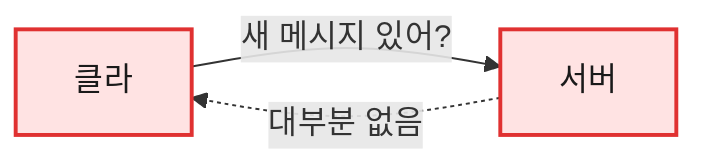
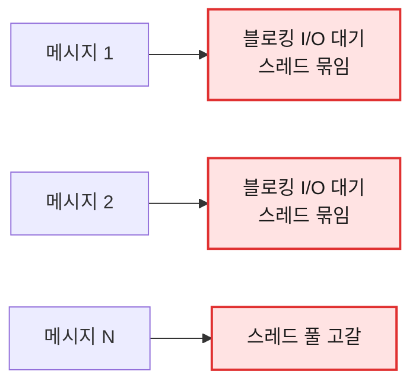
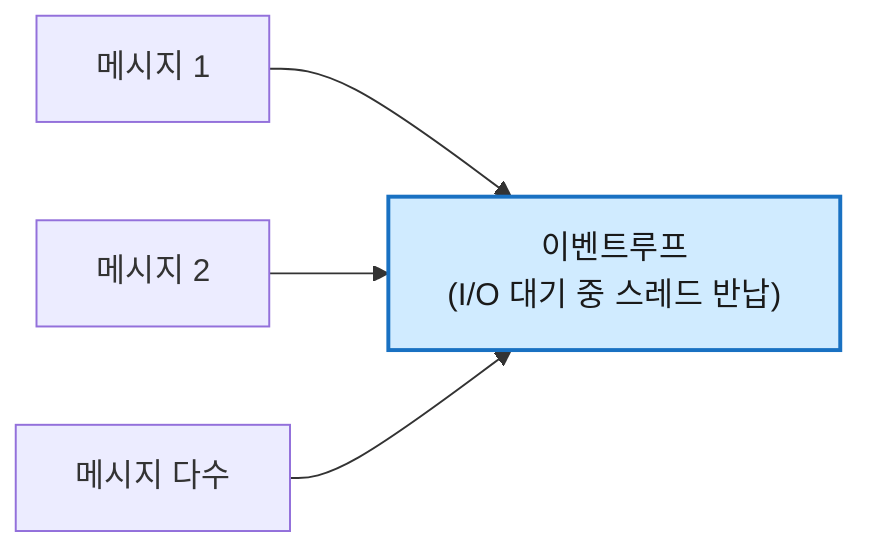
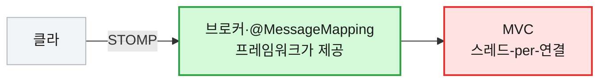
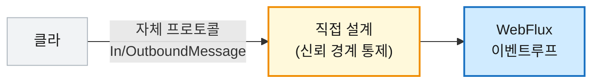
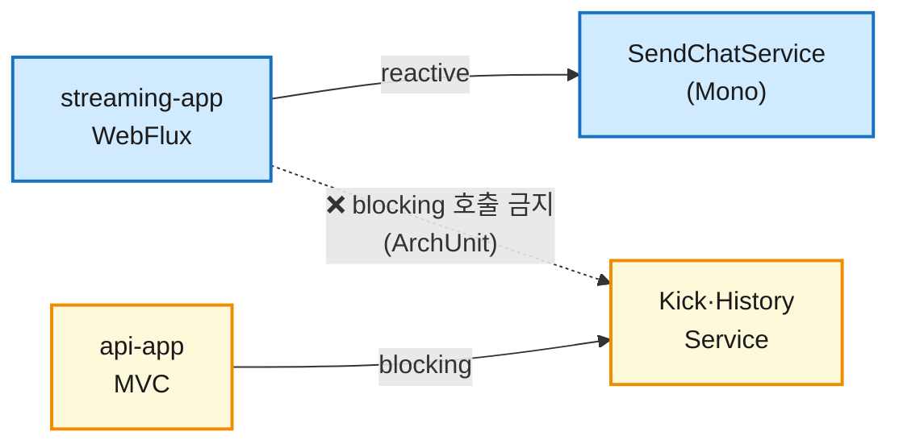

# [WebFlux] 라이브 커머스 채팅 서버 — WebSocket을 어떤 스택으로 받을까 (WebFlux vs MVC)

> ⚠️ 이 글은 "정답"이 아니라, 라이브 채팅 서버를 맡으며 전송 기술과 웹 스택을 고른 과정을 정리한 **결정 기록**입니다. 동접 규모(수천~수만)는 측정값이 아니라 설계 단계의 **목표 가정**이며, reactive 계약과 도메인 로직은 코드로 구현돼 있지만 전송 계층(WebSocket 핸들러)은 아직 구현 중입니다.

## 1. 들어가며

이번 팀 프로젝트에서 저는 **라이브 커머스의 채팅 서버**를 맡게 됐습니다. 방송을 보면서 실시간으로 떠드는, 그 채팅창입니다.

채팅은 메시지가 **양방향으로, 그것도 실시간으로** 오가야 합니다. 그래서 전송 기술은 일찌감치 **WebSocket**으로 좁혀졌습니다. 여기까지는 채팅을 만들어 본 사람이라면 누구나 떠올리는, 가장 익숙한 출발점입니다.

진짜 고민은 그다음이었습니다. **"이 WebSocket 연결을 어떤 웹 스택으로 받을 것인가."** 우리 서비스의 일반 REST API는 Spring MVC로 돌아가는데, 채팅도 같은 스택에 얹을지 아니면 WebFlux로 분리할지가 문제였습니다. 이 글은 그 갈림길에서 **실시간 채팅 평면만 WebFlux로 떼어낸 이유와, 그 대가로 무엇을 떠안았는지**에 대한 기록입니다.

> 미리 밝혀 둘 게 있습니다. 아래에서 말하는 "동접 효율"은 프레임워크가 동작하는 방식을 보고 내린 판단이지, 부하 테스트로 직접 재 본 수치가 아닙니다. 공식 문서가 말하는 사실과 제가 내린 결정은 최대한 구분해서 적었습니다.

## 2. 먼저, 왜 채팅은 WebSocket인가

스택 이야기를 하기 전에 WebSocket부터 짚고 가겠습니다.

일반적인 HTTP는 **요청-응답** 모델입니다. 클라이언트가 물어봐야 서버가 답합니다. 그런데 채팅은 반대입니다. **"언제 올지 모르는 남의 메시지"를 서버가 먼저 밀어줘야** 합니다. 이걸 HTTP로 흉내 내려면 클라이언트가 "새 메시지 있어요?"를 끝없이 되묻는 **폴링**을 해야 하는데, 대부분 "없음"이 돌아오는 헛질문이라 낭비가 큽니다.

WebSocket은 이 구조를 바꿉니다. 한 번 연결을 맺으면 그 연결을 **계속 열어 둔 채 양방향으로** 메시지를 주고받습니다. 클라이언트가 되묻지 않아도 **서버가 새 메시지를 곧바로 밀어줄 수 있습니다.** 실시간 채팅·알림에 WebSocket이 정석인 이유입니다.


*❌ HTTP 폴링 — 계속 되묻기*


*✅ WebSocket — 한 번 연결, 양방향*

여기서 핵심은 **연결이 오래 유지된 채, 그 위로 메시지가 동시다발로 오간다**는 점입니다. REST 요청처럼 "왔다가 바로 끝"이 아니라, 방송이 끝날 때까지 수많은 연결이 동시에 떠 있고 인기 방송에선 그 위로 메시지가 한꺼번에 쏟아집니다. **이 동시에 쏟아지는 메시지를 어떻게 감당하느냐**, 여기서 스택 선택이 갈립니다.

## 3. 진짜 갈림길: 그 연결을 어떤 스택으로 받나

WebSocket 연결을 받아 처리하는 방식은 웹 스택마다 다릅니다. 먼저 흔한 오해부터 정리하겠습니다. **연결을 그냥 열어 두는 것 자체는 둘 다 무겁지 않습니다.** 요즘 서블릿 컨테이너(Tomcat)도 WebSocket은 NIO로 처리해서, 메시지가 안 오는 idle 연결은 셀렉터가 감시만 할 뿐 스레드를 붙잡지 않습니다. 수만 개의 조용한 연결을 유지하는 일은 MVC도 적은 스레드로 해냅니다.

차이는 **메시지가 실제로 도착해 처리될 때** 드러납니다.

**Spring MVC**는 도착한 메시지를 **서블릿 스레드 풀**에서 처리합니다. 문제는 그 처리에 저장(DB)·전파(Redis) 같은 **블로킹 I/O가 끼면, I/O가 끝날 때까지 그 스레드가 묶인다**는 점입니다. 동시에 처리 중인 메시지가 많아질수록 묶인 스레드가 쌓여 풀이 고갈됩니다.

**Spring WebFlux**는 같은 처리를 **이벤트루프**에서 논블로킹으로 합니다. I/O를 기다리는 동안 스레드를 붙잡지 않고 반납했다가 콜백으로 이어가므로, **적은 스레드로 동시에 진행 중인 많은 메시지**를 감당합니다.


*❌ MVC — 블로킹 처리 중 스레드가 묶여, 동시 메시지가 몰리면 풀 고갈*


*✅ WebFlux — I/O 대기 동안 스레드를 놓아, 적은 스레드로 다수 처리*

## 4. 왜 WebFlux였나

3장에서 본 차이 — 블로킹 처리 중 스레드가 묶이느냐 — 가 우리 트래픽에서 결정타가 됩니다.

라이브 커머스는 인기 방송 하나에 시청자가 순식간에 몰리는 구조입니다(목표 가정: 한 방에 수천~수만). 평소엔 조용하다가도 이벤트가 터지면 짧은 시간에 **메시지가 동시다발로 쏟아집니다.** 그리고 메시지 한 건을 처리하는 데는 보통 저장(DB)·전파(Redis) 같은 **I/O가 따라붙습니다.**

- MVC라면 이 동시 메시지가 각자 블로킹 I/O를 기다리는 동안 서블릿 스레드를 하나씩 잡습니다 → 버스트에 풀이 고갈되고 지연이 치솟습니다.
- WebFlux는 I/O 대기 중 스레드를 반납하므로, 같은 버스트를 적은 스레드로 흘려보냅니다.

이런 트래픽엔 이벤트루프가 잘 맞는다고 봤습니다. 단, 이 이점은 공짜가 아닙니다 — **처리 사슬 어디에도 블로킹이 없어야** 성립합니다. 이 얘기는 뒤에서 마저 풀겠습니다.

> 💡 한 가지 분명히 해 둘 것은, **MVC를 버린 게 아니라는** 점입니다. 라이브 CRUD·강퇴·채팅 이력 조회 같은 평범한 REST는 기존 api-app(MVC)에 그대로 뒀고, **실시간 WebSocket 채팅 평면만** 별도 앱(streaming-app)으로 떼어 WebFlux로 받았습니다. 트래픽 특성이 다른 두 평면을 분리해 **독립적으로 스케일(k8s HPA)** 하기 위해서입니다. "어디에 WebFlux를 쓸지 고르는 것"도 하나의 설계 결정이었습니다.

## 5. MVC vs WebFlux

정리하면 이렇습니다.

| 항목 | Spring MVC (REST 평면 유지) | Spring WebFlux (WS 채팅 평면) |
|---|---|---|
| idle 연결 유지 | NIO로 적은 스레드 (둘 다 저렴) | 이벤트루프로 적은 스레드 |
| 메시지 처리 | 서블릿 스레드 풀 | 이벤트루프(논블로킹) |
| 블로킹 I/O가 끼면 | 스레드 묶임 → 버스트에 풀 고갈 | 스레드 반납 → 버스트 흡수 |
| 기본 가정 | 블로킹해도 됨(큰 스레드 풀로 흡수) | **블로킹하면 안 됨** |
| 러닝커브·생태계 | 자료 풍부, 디버깅 쉬움 | Reactor 학습 비용, 디버깅 까다로움 |

표의 마지막 두 줄이 중요합니다. WebFlux는 공짜가 아니었습니다. **"블로킹하면 안 됨"이라는 가정**과 **러닝커브**가 그대로 비용으로 돌아왔고, 이 둘은 뒤에서 하나씩 풀어 보겠습니다.

## 6. 대가 ①: STOMP를 포기했다

WebSocket 위에서 채팅 메시징을 편하게 하는 길로 **STOMP**가 있습니다. WebSocket 위에 얹는 메시징 프로토콜로, Spring에서 `@MessageMapping`과 메시지 브로커로 pub/sub을 거의 공짜로 깔 수 있습니다. 클라이언트 SDK 생태계도 잘 갖춰져 있고요.

문제는 **Spring이 STOMP를 제대로 받쳐주는 건 서블릿(MVC) 스택 쪽**이라는 점입니다. reactive WebFlux 쪽 WebSocket에는 STOMP·메시지 브로커에 해당하는 항목이 없습니다. 즉 **동시 연결 효율을 위해 WebFlux를 택하는 순간, STOMP의 표준 지원을 포기**하게 됩니다. 이게 이 선택의 가장 큰 트레이드오프였습니다.


*❌ MVC + STOMP — 메시징은 공짜로 얻지만, 동접 효율을 잃는다*


*✅ WebFlux + 순수 WebSocket — 동접 효율을 얻는 대신, 프로토콜을 직접 설계한다*

그래서 **순수 WebSocket**으로 가고, **메시지 프로토콜을 직접 설계**하기로 했습니다. 클라→서버(`InboundMessage`)와 서버→클라(`OutboundMessage`)를 직접 정의하는 비용을 감수한 겁니다.

다만 이 "직접 설계"가 손해만은 아니었습니다. 프로토콜을 통제하니 **신뢰 경계를 제 손으로 그을 수 있었습니다.** 채팅에서 제일 위험한 건 클라이언트가 "나는 판매자다", "이건 공지다"라고 신원을 위조하는 것입니다. 그래서 클라이언트가 보낼 수 있는 건 **메시지 타입·내용·재전송 키뿐**이고, 발신자 신원과 방 주인 여부는 **서버가 인증 세션에서 채웁니다.**

```java
// 클라이언트 → 서버 — 클라가 정하는 건 이게 전부다
record InboundMessage(
        String type,        // CHAT (현재 유일한 클라 발신 타입)
        String messageType, // NORMAL | NOTICE
        String content,
        String clientMsgId  // nullable — 멱등성 키
) { }

// .../command/SendChatCommand.java (서버가 신원을 채워 만드는 입력 — 대표 일부)
public record SendChatCommand(
        UUID roomId,            // 서버 신뢰 (연결 컨텍스트)
        UUID senderId,          // 서버 신뢰 (세션)
        String senderRole,      // 서버 신뢰 — 권한 판정
        boolean isRoomOwner,    // 서버 신뢰 — 공지 권한(방 주인만)
        // …(발신 스냅샷·클라 입력 필드 생략)
        String content
) { /* … 서버 신뢰 필드 누락 시 거부하는 컴팩트 생성자 생략 … */ }
```

> 💡 STOMP를 썼다면 프레임워크가 정해 준 프레임 위에서 움직였을 겁니다. 포기한 대신, "무엇을 클라이언트가 정하게 둘 것인가"를 한 줄 한 줄 직접 정할 자유를 얻었습니다.

## 7. 대가 ②: "블로킹 금지"는 채팅 송신 평면을 지배했다

WebFlux의 진짜 비용은 여기서 나옵니다. 이벤트루프는 적은 스레드로 돌기 때문에, **그중 하나라도 블로킹 호출에 멈추면 그 스레드가 맡던 수많은 연결이 통째로 대기**합니다. MVC라면 스레드 하나 잠깐 멈추는 정도로 끝날 일이, WebFlux에선 전체 처리량을 깎아먹습니다.


다만 분명히 해 둘 게 있습니다. 이 "블로킹 금지"는 **시스템 전체의 규칙이 아닙니다.** 강퇴·채팅 이력 조회 같은 **REST는 여전히 api-app에서 블로킹 MVC로** 돌아갑니다 — 오히려 그 유스케이스들은 일부러 `void`·일반 결과 객체(블로킹) 타입으로 뒀습니다. MVC에서 `Mono`를 받으면 결국 `.block()`을 호출하게 되는데, 그게 이점도 없이 복잡도만 키우기 때문입니다. 즉 **블로킹 금지는 오직 이벤트루프 위에서 도는 WS 송신 평면(streaming-app)에만** 걸린 제약입니다.


*같은 chat-core 안에 reactive·blocking 유스케이스가 공존한다 — 각 앱은 자기 스택의 것만 호출한다*

그래서 제약을 받는 건 streaming-app 한쪽이지만, 그 한쪽에서는 위에서 아래까지 결정이 줄줄이 따라왔습니다.

**① 서블릿 스택은 의존조차 할 수 없었다.** 블로킹 이전에 **스택 결정 충돌**이 먼저였습니다. 공용 웹 모듈은 `spring-boot-starter-web`(Tomcat/Servlet)을 끌고 오는데, 이게 클래스패스에 있으면 Spring Boot가 앱을 **서블릿 모드로 띄워** WebFlux 의도가 무력화됩니다(WebFlux 앱으로 띄우려면 web starter가 없어야 합니다). 그래서 streaming-app은 그 모듈에 **의존 자체를 안 하고**, 그 안에 있던 **JWT 검증 계약만 Servlet-free 모듈로 추출**해 MVC 앱과 WebFlux 앱이 같은 코덱을 공유하도록 설계했습니다(검증 로직 복제 0).

**② 송신 경로의 저장·캐시는 reactive 드라이버로.** 메시지 한 건을 보내는 흐름은 **권한 → 욕설 필터 → 저장 → 브로드캐스트**로 이어집니다. 이 사슬에 블로킹이 끼면 이벤트루프가 멈추므로, streaming-app이 타는 경로에는 **reactive MongoDB·reactive Redis 드라이버**를 물렸습니다(`build.gradle`의 reactive 스타터). reactive 저장은 `Mono`를 돌려주니, 저장과 전파가 한 번도 끊기지 않고 이어지도록 설계했습니다.

```java
// SendChatService — 저장과 전파가 끊김 없는 reactive 체인 (대표 골격)
return chatMessageRepository.save(message)               // reactive Mongo → Mono<ChatMessage>
        .flatMap(saved -> broadcaster.publish(roomId, saved)  // reactive Redis pub/sub
                .thenReturn(toView(saved)))              // Mono<ChatMessageView>
// .block()·.subscribe() 없음 — 이벤트루프를 놓지 않는다
```

흥미로운 건 **같은 `chat_messages` 컬렉션을 두 방식으로 다루도록 설계했다**는 점입니다. 송신 경로(streaming-app)는 reactive 드라이버로 **쓰고**, 이력 조회(api-app)는 평범한 블로킹 드라이버로 **읽습니다**(각 앱의 `build.gradle`에 reactive·blocking Mongo 스타터가 따로 물려 있습니다). 저장소가 같아도, 그 위에 어떤 드라이버를 얹느냐는 평면마다 다릅니다.

**③ 메시지마다 DB를 조회하지 않게 설계했다.** 발신자 닉네임·이메일은 발신 시점 값을 **스냅샷**으로 명령에 담아 두고, 방의 진행 상태는 **연결할 때 한 번** 확인한 뒤 세션 메모리 플래그와 pub/sub 이벤트로만 갱신하도록 했습니다. "메시지당 블로킹 I/O 0"을 지키기 위한 결정들입니다.

**④ 동기 CPU 작업은 오히려 괜찮다.** 헷갈리기 쉬운데, **블로킹 I/O**가 문제지 짧은 **CPU 연산**은 아닙니다. JWT 파싱이나 욕설 필터(Aho-Corasick)는 동기 CPU지만 입력이 작고 선형이라 이벤트루프에서 직접 돌려도 안전하다고 봤습니다(규모가 더 커지면 필터를 별도 스케줄러로 오프로드하는 건 과제로 열어 뒀습니다).

**⑤ 사람의 실수는 컴파일/CI에서 막는다.** 까다로운 건, chat-core가 reactive·blocking 유스케이스를 **한 모듈에 품고** 있어 streaming-app에도 블로킹 빈이 전이로 딸려온다는 점입니다. 그래서 처방을 "의존을 끊는다"가 아니라 **"존재는 허용하되 호출만 금지한다"**로 잡고 **ArchUnit 규칙으로 강제하도록 설계했습니다.** streaming 패키지가 블로킹 `StringRedisTemplate`이나 블로킹 유스케이스(`KickUserService` 등)에 의존하면 **빌드가 깨지도록** 하는 거죠. 반대로 api-app(MVC)이 reactive 유스케이스를 호출하는 것도 같은 규칙으로 막습니다 — 각 앱이 **자기 스택의 것만** 부르도록요.

> ✅ 핵심은 이겁니다 — WebFlux는 "선언하면 빨라지는 옵션"이 아니라, **그 평면에 발을 들인 코드 전부가 '블로킹 금지'를 받아들여야** 효율이 나오는 구조입니다. 그래서 우리는 채팅 전체를 reactive로 갈아엎은 게 아니라, **블로킹이 치명적인 송신 평면만 reactive로 격리하고** 나머지는 익숙한 MVC에 남겨 둔 뒤, 그 경계를 ArchUnit으로 못 박았습니다.

## 8. 솔직한 트레이드오프

물론 이 선택이 정답은 아닙니다. 잃은 것과 얻은 것을 정직하게 적으면 이렇습니다.

- **잃은 것**: STOMP가 주던 편의(메시지 브로커·클라 SDK 생태계), 메시지 프로토콜을 직접 설계·유지보수하는 부담, "블로킹 금지"라는 상시 제약과 Reactor 러닝커브.
- **얻은 것**: 메시지가 한꺼번에 몰려도 적은 스레드로 버티는 동접 효율, 프로토콜을 내 손으로 완전히 통제(신뢰 경계·필드 최소화), 전송부터 저장까지 끊김 없이 이어지는 리액티브 흐름.

그리고 아직 풀지 않은 숙제도 분명히 있습니다. **여러 Pod에 흩어진 시청자에게 메시지를 뿌리는 fan-out**은 지금 단일 Redis Pub/Sub 채널로 처리하는데, 동접이 정말 수만으로 가면 이 채널이 병목이 될 수 있어 채널 샤딩이나 다른 메시징으로의 전환을 과제로 열어 뒀습니다. **느린 클라이언트로 인한 outbound 버퍼 적체(backpressure)**도 아직 설계가 더 필요한 부분이고요. 이런 건 "WebFlux를 쓰면 공짜로 해결되는 문제"가 아니라, **WebFlux를 쓰기로 했기 때문에 새로 떠안은 문제**입니다.

가장 중요한 건 이겁니다. **트래픽이 크지 않은 서비스라면 MVC + STOMP가 더 합리적입니다.** 자료 많고, 디버깅 쉽고, 메시징을 거의 공짜로 깔 수 있으니까요. 제가 WebFlux를 고른 건 어디까지나 **"한 방송에 동접이 폭증한다"는 가정**에 종속된 결정입니다. 그 가정이 틀리면 이 선택의 근거도 같이 흔들립니다.

> 그래서 "어떤 스택을 고를지"는 성능 문제이기 이전에, **내 서비스의 트래픽 모양을 어떻게 가정하느냐**의 문제라고 생각하게 됐습니다.

## 9. 정리

정리하면 이렇습니다. 채팅은 양방향·실시간이라 전송은 **WebSocket**이 정석이고, 그 연결은 **오래 살아 있다**는 특성이 있습니다. 그래서 강퇴·이력 같은 평범한 REST는 MVC에 그대로 두고, **연결이 폭증하고 메시지가 몰리는 실시간 채팅 송신 평면만** 떼어내 WebFlux로 받았습니다. 그 송신 평면에 한해 **STOMP의 편의를 포기**하고 순수 WebSocket으로 프로토콜을 직접 설계했으며(그 덕에 신뢰 경계는 직접 통제), **"블로킹 금지"를 받아들여** 서블릿 의존을 분리하고 reactive MongoDB/Redis 드라이버를 물렸으며 메시지당 DB조회를 없애도록 설계했고, reactive와 blocking 유스케이스가 한 모듈에 공존하는 경계는 **ArchUnit 규칙**으로 가르도록 했습니다.

다시 말하지만 동접 수치는 측정값이 아니라 목표 가정이고, fan-out 병목이나 backpressure처럼 이 선택이 새로 떠안긴 숙제도 남아 있습니다. 트래픽이 작다면 MVC + STOMP가 더 나은 답일 수 있습니다. 그럼에도 이번 프로젝트의 가정 위에서는, 이 트레이드오프를 감수할 가치가 있다고 봤습니다.

### 📎 References

- [MDN — The WebSocket API (양방향 통신, 폴링 불필요)](https://developer.mozilla.org/en-US/docs/Web/API/WebSockets_API)
- [Spring WebFlux — Overview (non-blocking, event loop, fewer threads)](https://docs.spring.io/spring-framework/reference/web/webflux/new-framework.html)
- [Spring Framework — STOMP over WebSocket (Servlet stack)](https://docs.spring.io/spring-framework/reference/web/websocket/stomp.html)

