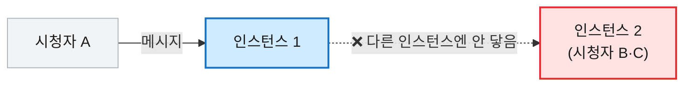
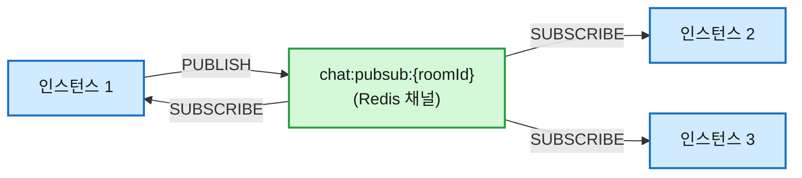

# [Redis] Redis Pub/Sub을 채팅에 도입한 이유 — Kafka 없이 서버 간 메시지 뿌리기

## 1. 들어가며

라이브 커머스는 인기 방송 하나에도 시청자가 수천 명씩 몰릴 수 있고, 그런 방송이 동시에 여러 개 열립니다. 채팅 서버 한 대로 이 부하를 다 받아내는 건 무리입니다. 그래서 streaming-app은 처음부터 **같은 앱을 여러 인스턴스로 복제해 띄우는 분산 환경**으로 설계해, 트래픽을 나눠 받도록 했습니다.

그런데 인스턴스를 늘리는 순간 당연한 숙제가 생깁니다. 시청자는 로드밸런서를 거쳐 아무 인스턴스에나 붙으니, **같은 방 사람들이 서로 다른 인스턴스에 흩어집니다.** 한 인스턴스가 받은 메시지를 다른 인스턴스에 붙은 사람에게도 보내줘야 하는데, 이걸 무엇으로 할 것인가. **실시간 채팅에서 이런 인스턴스 간 전파를 두고 흔히 거론되는 도구가 Redis Pub/Sub과 Kafka입니다.** 이 글은 그 둘을 두고 **전파는 Redis Pub/Sub으로, 보관은 MongoDB로** 나눠 맡기고 **이 일엔 Kafka를 쓰지 않은** 이유에 대한 기록입니다.

## 2. 인스턴스가 여럿이 되자 생긴 문제

한 대로 돌 때는 이런 고민이 없었습니다. 모두 같은 인스턴스에 붙어 있으니, 메시지를 받으면 그 인스턴스에 연결된 사람들에게 뿌리면 끝이었습니다.

인스턴스를 늘리면 그림이 깨집니다. A가 친 메시지는 A가 붙은 인스턴스 안에서만 돌고, 다른 인스턴스에 붙은 B·C에게는 닿지 않습니다.

그래서 **"한 인스턴스가 받은 메시지를, 같은 방을 보는 모든 인스턴스에 퍼뜨리는"** 장치가 필요해졌습니다. 흔히 fan-out이라 부르는 일입니다.

## 3. Redis Pub/Sub과 Kafka, 무엇이 다른가

실시간 채팅의 인스턴스 간 전파라고 하면 보통 이 둘 — Redis Pub/Sub과 Kafka — 이 먼저 거론됩니다. 그래서 우리 후보도 자연스럽게 이 둘이었는데, 같은 일을 한다고 묶이지만 성격은 정반대입니다. 고르기 전에 각각 뭔지부터 짧게 짚고 가겠습니다.

**Redis Pub/Sub** — Redis 안에 들어 있는 가벼운 발행/구독(publish/subscribe) 기능입니다. 누군가 채널에 메시지를 던지면(publish), 그 채널을 듣고 있는(subscribe) 모두에게 그 즉시 전달됩니다. 핵심은 **보관하지 않는다**는 것 — 지금 듣고 있는 사람만 받고, 메시지는 흘러가면 끝입니다. **라이브 라디오**에 가깝습니다. 방송이 나가는 순간 듣고 있지 않으면, 그 방송은 다시 들을 수 없습니다.

**Kafka** — 분산 이벤트 스트리밍 플랫폼입니다. 이벤트를 디스크에 **로그로 차곡차곡 영속 저장**하고, 소비자가 원하는 지점부터 **몇 번이고 다시 읽을 수 있습니다.** **녹화 방송**에 가깝습니다. 나중에 들어와도 처음부터 되감아 볼 수 있고, 한 번 쌓인 메시지는 웬만해선 잃지 않습니다.

쉽게 말하면 — **Redis Pub/Sub은 "지금 이 순간"의 라이브, Kafka는 "되감기 되는" 녹화**입니다. 그래서 선택은 "나한테 라이브가 필요한가, 녹화가 필요한가"로 좁혀졌습니다.

## 4. 무엇을 남기고, 무엇을 흘려보낼까

라이브냐 녹화냐를 가르기 전에, 질문 하나에 먼저 답해야 했습니다. **라이브 커머스 채팅을 정말 다 저장해야 하나?** 대부분은 "와 예뻐요", "재고 있어요?" 같은 흘러가는 잡담이라, 영구 보관까지 할 가치가 있나 싶었습니다.

따져 보니 답은 **"그래도 남긴다, 대신 영원히는 아니다"** 였습니다. 잡담처럼 보여도 다시보기에선 현장감이 되고, 어떤 한마디가 분쟁의 증거가 될지는 미리 알 수 없기 때문입니다. 대신 **2년이 지나면 자동 삭제**(TTL)해서 무한정 쌓이는 비용만 끊었습니다.

그럼 저장에서 빠지는 건 뭐냐 — **잡담이 아니라 "흘러가는 신호"입니다.** 강퇴·라이브 종료·밴 같은 시스템 알림은 그 순간 화면에 띄우면 그만이라, MongoDB에 남기지 않고 각 인스턴스가 받아서 렌더만 합니다. 다시보기에 "○○님이 강퇴되었습니다"가 박제될 이유는 없습니다.

남기는 쪽(일반 채팅·공지)을 굳이 MongoDB에 쌓는 이유는 커머스라서 더 분명했습니다.

- **다시보기**: 방송을 다시 볼 때 그 시점 채팅이 같이 흘러야 현장감이 살고, "이거 사이즈 어때요?" 같은 상품 문답은 그 자체로 정보가 됩니다.
- **강퇴자 가리기(다시보기)**: 진상으로 강퇴당한 사람 메시지가 다시보기에서 또 뜨면 안 되는데, 메시지가 senderId와 함께 저장돼 있으니 이력 조회 때 그 사람 것만 빼고 돌려줄 수 있습니다.
- **분쟁·신고**: 거래가 엮인 만큼 증거가 필요해, 강퇴 땐 유발 메시지 원문을 그대로 박제합니다.

결국 **"무엇을 진실로 남길지"를 먼저 정하고, 그 진실은 MongoDB에 맡긴** 셈입니다.

## 5. 우리 선택: Redis Pub/Sub + MongoDB

그러고 나니 역할 분담이 또렷해졌습니다. 보관이 필요한 메시지는 이미 **MongoDB**가 책임지니, 전파 장치에까지 보관을 요구할 이유가 없었습니다. 필요한 건 **접속한 인스턴스들에 빨리 뿌리는 것** — 그게 **Redis Pub/Sub**을 선택한 이유입니다.

**보관은 MongoDB, 전파는 Redis Pub/Sub.** 한 인스턴스가 메시지를 받으면 MongoDB에 저장하고, 같은 방 채널(`chat:pubsub:{roomId}`)에 publish하면, 그 채널을 구독 중인 모든 인스턴스가 받아 각자 자기 시청자에게 뿌립니다.

마침 채팅은 rate limit·세션·방 상태를 이미 Redis에 두고 있어, 전파도 같은 Redis에 얹으니 메커니즘이 하나로 모였습니다. 라이브 종료 같은 이벤트도 같은 방식(`live:room:ended` 채널)으로 전 인스턴스에 알리면 됩니다.

## 6. 그래도 Kafka는?

Kafka도 당연히 후보였습니다. **"Kafka로 채팅을 쌓으면 영속성도 얻고 다시보기 재생도 되지 않나?"** — 저도 잠깐 그렇게 생각했습니다. 그런데 두 군데서 갈렸습니다.

**첫째, 전파에는 영속·재생이 필요 없습니다.** 메시지의 진실은 앞서 정했듯 이미 MongoDB가 쥐고 있으니, 전파 장치가 또 녹화까지 할 이유가 없습니다.

**둘째, "다시보기"가 요구하는 건 로그 재생이 아니라 쿼리입니다.** 4장의 다시보기·강퇴자 가리기를 다시 떠올려 보면 — **"이 방의, 강퇴자를 뺀 메시지를 페이지 단위로"** 꺼내야 합니다. 이건 인덱스로 거르고 페이징하는 **데이터베이스(MongoDB)의 일**이지, 처음부터 끝까지 순서대로 흘려보내는 **로그(Kafka)의 일**이 아닙니다. Kafka로 같은 다시보기 화면을 만들려면 토픽을 통째로 다시 읽어 애플리케이션이 직접 걸러야 하고, 강퇴자 제외나 임의 페이징은 Kafka가 주는 기능이 아닙니다.

결국 Kafka가 내세우는 강점(영속·재생)은 **전파로는 군더더기였고, 저장으로는 MongoDB가 더 맞았습니다.**

| | Redis Pub/Sub + MongoDB (채택) | Kafka (이 일엔 기각) |
|---|---|---|
| 실시간 전파 | Pub/Sub로 충분 | 가능하나 과함 |
| 다시보기·이력 | MongoDB **쿼리**(방·강퇴자 제외·페이징) | **로그 재생**뿐 — 쿼리·필터는 본업 아님 |

> ✅ 한 줄로 줄이면 — **진실은 MongoDB가 갖고(쿼리로 다시보기·강퇴자 제외), Pub/Sub은 "지금 누구에게"만 푼다. Kafka의 영속·재생은 전파엔 군더더기, 저장엔 MongoDB가 더 맞았다.**

## 7. Redis Pub/Sub만으론 부족한 것들

Redis Pub/Sub은 가벼운 만큼 빈 곳을 직접 채워야 했습니다.

**저장이 먼저, 전파가 나중.** 메시지를 받으면 **MongoDB에 먼저 쓰고 그다음 publish**하도록 순서를 못 박았습니다. 재전송으로 같은 메시지가 두 번 들어와도 저장 단계에서 중복(`clientMsgId`)을 걸러 **두 번 뿌리지 않게** 했습니다.

**채널은 용도별로 나눴습니다.** 채팅(`chat:pubsub:{roomId}`)과 라이브 종료(`live:room:ended`)를 다른 채널로 분리했습니다. 한 채널에 다 실으면 받는 쪽이 매번 "이게 채팅이야 종료 신호야"를 가려야 하기 때문입니다. 채팅 채널엔 일반 메시지와 강퇴 이벤트가 같이 흐르는데, 이건 봉투에 종류를 적어(`{"kind":"CHAT"...}` / `{"kind":"KICK_EVENT"...}`) 받는 인스턴스가 그것만 보고 분기하게 했습니다. **강퇴 이벤트를 받은 인스턴스는 그 사람 연결을 끊고, 다른 시청자 화면에서도 그 사람 메시지를 실시간으로 가립니다 — 같은 Pub/Sub 채널이 메시지 fan-out과 강퇴 전파를 함께 나르는 셈입니다.** (다시보기에서 그 사람을 빼는 건 4장처럼 MongoDB 쿼리가 맡습니다.)

## 8. 솔직한 트레이드오프

가벼운 선택엔 분명한 약점이 따릅니다. 숨기지 않고 적으면 이렇습니다.

**Redis Pub/Sub은 한 번 흘린 메시지를 책임지지 않습니다.** 발행하는 그 순간 구독 중이 아닌 인스턴스는 그 메시지를 영영 못 받습니다(at-most-once). 우리가 이걸 감당할 수 있는 건 메시지가 **이미 MongoDB에 있어서 이력에선 안 사라지기** 때문입니다. 다만 "지금 접속 중인데 하필 그 찰나에 전파를 놓친" 사용자에겐 그 메시지가 실시간으로는 빠질 수 있고, 이건 받아들인 트레이드오프입니다.

**더 커지면 채널 하나가 병목입니다.** 지금은 방마다 채널 하나인데, 동접이 정말 수만으로 가면 그 채널의 fan-out이 한계를 칠 수 있습니다. 그땐 채널을 잘게 쪼개거나(샤딩), 정 필요하면 Kafka로 갈아타는 걸 숙제로 열어 뒀습니다.

> 그래서 **메시지를 한 통도 잃으면 안 되거나, 지나간 걸 다시 재생해야 하는 서비스라면 처음부터 Kafka가 맞습니다.** Redis Pub/Sub은 어디까지나 "진실은 따로 있고, 전파는 실시간만"이라는 우리 구조 위에서의 답입니다.

## 9. 정리

정리하면 이렇습니다. 채팅 서버를 여러 인스턴스로 띄우자 같은 방 사람들이 서로 다른 인스턴스에 흩어지는 문제가 생겼고, 한 인스턴스가 받은 메시지를 모든 인스턴스에 퍼뜨릴 fan-out이 필요해졌습니다. Redis Pub/Sub과 Kafka는 각각 "라이브"와 "녹화"였는데, 먼저 **무엇을 남길지**를 정하고 나니(흘러가는 신호는 버리고 내용 있는 말만 MongoDB에 2년) **진실은 MongoDB가 갖는다**는 게 분명해졌습니다. 그러니 전파 장치엔 녹화 능력이 필요 없었고, **보관은 MongoDB·전파는 Redis Pub/Sub**으로 나눈 뒤 이 일엔 Kafka를 쓰지 않았습니다. 가벼운 도구의 빈틈은 persist-then-publish·채널 분리·봉투(kind)로 직접 메웠습니다.

다시 말하지만 Redis Pub/Sub은 한 번 흘린 메시지를 책임지지 않고, 단일 채널은 규모가 커지면 병목이 됩니다. 메시지를 잃으면 안 되거나 재생이 필요하면 Kafka가 맞습니다. 그럼에도 "진실은 MongoDB, 전파는 실시간만"이라는 우리 구조에서는 이 선택이 가장 잘 맞았다고 봤습니다.

### 📎 References

- [Redis — Pub/Sub (fire-and-forget·미영속 전달)](https://redis.io/docs/latest/develop/interact/pubsub/)
- [Apache Kafka — Introduction (영속 저장·보존·재생)](https://kafka.apache.org/intro)

