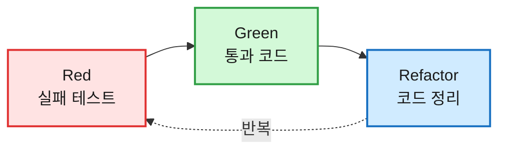
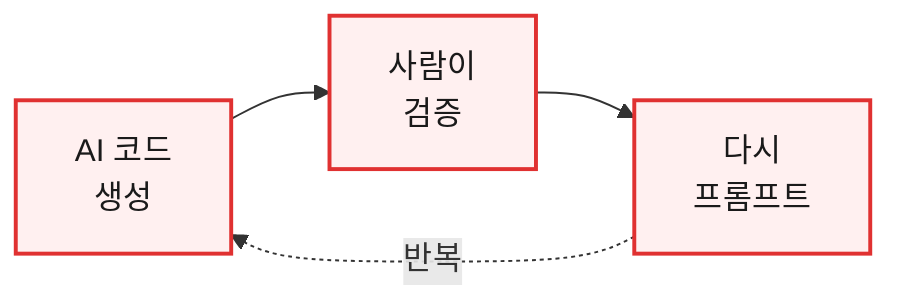
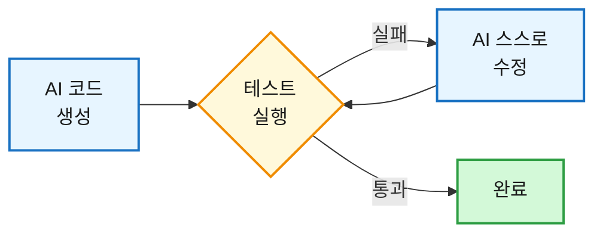

# [TDD] 라이브 커머스에 TDD를 도입한 이유 — 테스트를 먼저 쓰니 AI가 알아서 검증한다

> ⚠️ 라이브 커머스 서비스를 만들면서, 도메인 순수 로직부터 TDD를 기본으로 가져가고 있습니다. 이 글에서 드는 사례는 주로 실시간 채팅 쪽(권한 정책, 비속어 필터)이고, 실시간 송출·동시성 같은 I/O 경계는 통합 테스트로 따로 다룹니다.

## 1. 들어가며

솔직히 저는 "테스트를 먼저 짠다"는 말을 한동안 시간 낭비라고 생각했습니다. 그런데 유튜브 쇼츠를 보다가 한 문장에 멈칫했습니다. "TDD를 쓰면 AI 토큰도 아끼고, AI가 스스로 코드를 검증하면서 고쳐 나간다"는 이야기였습니다.

마침 저는 라이브 커머스 서비스를 만들고 있었습니다. 방송을 보면서 실시간으로 채팅하고 바로 상품을 사는, 그런 서비스입니다. 이런 서비스는 채팅 하나에도 규칙이 꽤 많습니다. 누가 공지를 띄울 수 있고 누구를 내보낼 수 있는지(권한), 욕설을 화면에 뜨기 전에 어떻게 거를지(필터) 같은 것들이죠. 요즘은 이런 코드를 AI 에이전트와 함께 짜는 일이 많다 보니, 앞의 말이 더 솔깃하게 들렸습니다.

그래서 이번 프로젝트는 처음부터 TDD를 기본 방식으로 가져가 보기로 했습니다. 이 글은 그 과정에서 정리한 개념과, 제가 도입을 결정한 이유에 대한 기록입니다.

> 한 가지 미리 밝혀 둘 게 있습니다. "토큰을 아낀다", "AI가 스스로 검증한다"는 건 어디까지나 제 경험과 판단이지, 수치로 측정한 사실은 아닙니다. 그래서 개념 설명과 제 의견은 아래에서 최대한 구분해 적었습니다.

## 2. TDD란 무엇인가

TDD(Test-Driven Development, 테스트 주도 개발)는 한마디로 기능을 구현하기 전에 테스트부터 작성해 개발을 이끌어 가는 기법입니다. Kent Beck이 1990년대 후반 익스트림 프로그래밍(XP)의 일부로 정립했고, 2003년 『Test-Driven Development: By Example』을 펴내며 널리 알려졌습니다.

TDD는 결국 더 짧은 피드백 주기를 통해 개발 속도를 의도적으로 늦추면서, 그만큼 코드를 자주 검증하고 다듬게 만드는 방식입니다. 처음엔 개발 시간이 늘어 보여도, 단위 수준에서 오류를 그때그때 잡아 나가기 때문에 작은 문제가 큰 문제로 번지는 걸 막아 줍니다.

흐름은 일반적인 개발과 반대입니다. 코드를 먼저 짜고 테스트를 나중에 붙이는 게 아니라, 실패하는 테스트를 먼저 쓰고 그걸 통과시키는 코드를 작성합니다.

### 🔁 Red - Green - Refactor



| 단계 | 하는 일 |
|------|--------|
| 🔴 **Red (실패)** | 추가할 기능에 대한 테스트를 먼저 씁니다. 아직 코드가 없으니 당연히 실패합니다. |
| 🟢 **Green (통과)** | 그 테스트를 통과시키는 코드를 씁니다. |
| 🔵 **Refactor (정리)** | 새로 짠 코드와 기존 코드를 깔끔하게 정리합니다. |

> 💡 TDD에서 가장 흔히 하는 실수가 바로 세 번째 단계인 Refactor를 빼먹는 것입니다. 일단 돌아가게 만든 다음(Green), 바르게 고친다(Refactor). 이 순서를 끝까지 지키는 게 핵심입니다.

특히 첫 단계인 Red에서는 테스트가 "제대로 실패하는지" 확인하는 일이 중요합니다. 작성하자마자 통과해 버리는 테스트는, 기능이 멀쩡해서가 아니라 그 테스트 자체가 잘못 짜였다는 신호일 수 있기 때문입니다.

여기서 중요한 건 테스트 커버리지 숫자가 아닙니다. "무엇이 맞는 동작인가"를 코드보다 먼저 명세로 못 박아 두는 것입니다.

## 3. 왜 라이브 커머스 채팅에 도입했나

라이브 커머스에서 채팅은 단순한 대화창이 아닙니다. 방송 중에 많은 사람이 동시에 들어와 메시지를 주고받기 때문에, "누가 무엇을 할 수 있는가"라는 규칙이 촘촘하게 필요합니다. 판매자는 공지를 띄우거나 진상 고객을 내보낼 수 있어야 하고, 일반 구매자는 그럴 수 없어야 합니다. 욕설은 화면에 뜨기 전에 걸러야 하고요.

그런데 이런 규칙 판단은 대부분 "순수 함수"에 가깝습니다. 순수 함수란 같은 입력을 넣으면 늘 같은 결과가 나오고, 바깥 상태를 건드리거나 그에 의존하지 않는 함수를 말합니다. 예를 들어 "이 역할의 사용자가 이 메시지를 보낼 수 있는가" 같은 판단은, 입력(역할과 상황)이 같으면 언제 호출하든 결과가 똑같습니다.

이런 로직은 테스트하기가 아주 쉽습니다. 데이터베이스를 띄우거나 외부 서비스를 흉내 낼 필요 없이, "이 입력을 넣으면 이 출력이 나와야 한다"만 적으면 그대로 테스트가 되기 때문입니다. 그래서 테스트를 먼저 쓰는 TDD와도 궁합이 잘 맞습니다.

그리고 여기서 앞서 본 쇼츠의 말이 연결됩니다. 테스트는 AI에게 건네는 일종의 정답지입니다.

**테스트가 없을 때**를 먼저 떠올려 보겠습니다. "기능 만들어 줘"라고만 하면 AI는 제가 원하는 동작을 추측해서 코드를 내놓습니다. 결과가 어긋나면 제가 그걸 눈으로 확인하고, 다시 말로 설명해서 고쳐 달라고 합니다. 이 "생성 → 사람이 확인 → 다시 설명"의 왕복이 계속 반복되는데, 매번 긴 설명이 오가고 그게 전부 토큰으로 쌓입니다. 게다가 자연어 설명은 또 다른 오해를 낳기도 합니다.  

❌ **테스트가 없으면 — 사람이 매번 끼어드는 루프**


반면 **테스트를 먼저 주면** 기준이 코드로 고정됩니다. AI는 추측하는 대신 테스트를 실행해 보고, 실패하면 어떤 입력에서 무엇이 기대와 달랐는지(에러 메시지)를 보고 스스로 고친 뒤 다시 돌립니다. 제가 중간에 일일이 끼어들지 않아도 "통과"라는 분명한 목표를 향해 알아서 수렴해 갑니다. 사람이 다시 설명하는 왕복이 줄어드니, 자연스럽게 토큰도 덜 쓰게 된다는 게 제 생각입니다.

✅ **테스트가 있으면 — AI가 스스로 도는 루프**


실제로 써 보니 제가 "아니 그거 말고"를 일일이 입력하는 횟수가 눈에 띄게 줄었습니다. 다시 말씀드리지만 이건 측정값이 아니라 어디까지나 체감입니다.

## 4. 테스트 나중에 vs 테스트 먼저

정리하면 두 방식의 차이는 이렇습니다.

| | 코드 먼저 → 테스트 나중 | TDD (테스트 먼저) |
|---|---|---|
| **명세** | 머릿속이나 문서에만 존재 | 테스트가 곧 실행 가능한 명세 |
| **회귀 발견** | 나중에, 그것도 운이 좋아야 | 고치는 즉시 빨간불로 |
| **AI 협업** | 사람이 결과를 눈으로 검증 | 테스트가 자동으로 검증, AI가 스스로 반복 |
| **위험** | 통과만 보고 안심 | Refactor를 빼먹으면 코드가 지저분해짐 |

## 5. 실제로 어떻게 적용했나

방식 자체는 단순합니다. 테스트 케이스를 표로 먼저 설계한 다음, 그대로 JUnit으로 옮깁니다.

예를 들어 채팅 권한 정책은 역할(판매자·구매자·관리자·게스트), 방 소유 여부, 메시지 타입(일반·공지·시스템)이 엮인 경우의 수 매트릭스입니다. "판매자는 자기 방에서 공지를 띄울 수 있다", "게스트는 아무 메시지도 보낼 수 없다" 같은 규칙이 칸칸이 들어갑니다. 이 표를 그대로 `@ParameterizedTest`(같은 테스트를 여러 인자로 반복 실행하는 기능)로 옮겼습니다. 케이스는 수십 개에 이르는데, 보안상 규칙 전체는 공개하지 않고 패턴만 보여 드리겠습니다.

```java
// .../ChatPermissionPolicyTest.java (대표 일부 발췌)
@DisplayName("ChatPermissionPolicy")
class ChatPermissionPolicyTest {

    private final ChatPermissionPolicy policy = new ChatPermissionPolicy();

    @DisplayName("canSend — 권한 매트릭스")
    @ParameterizedTest(name = "{0}")
    @MethodSource("canSendCases")
    void canSend(String tc, ChatRole role, boolean isRoomOwner, ChatMessageType type, boolean expected) {
        boolean result = policy.canSend(role, isRoomOwner, type);
        assertThat(result).isEqualTo(expected);
    }

    static Stream<Arguments> canSendCases() {
        return Stream.of(
                arguments("BUYER·일반 → 허용",        ChatRole.BUYER,  false, new ChatMessageType.Normal(), true),
                arguments("BUYER·공지 → 거부",        ChatRole.BUYER,  false, new ChatMessageType.Notice(), false),
                arguments("SELLER(방주인)·공지 → 허용", ChatRole.SELLER, true,  new ChatMessageType.Notice(), true),
                arguments("GUEST·무엇이든 → 거부",     ChatRole.GUEST,  false, new ChatMessageType.Normal(), false)
                // …(나머지 케이스는 비공개)
        );
    }

    // 강퇴 권한 canKick(...) 도 같은 방식의 매트릭스로 검증 — 생략
}
```

표를 그대로 테스트로 옮기니 좋은 점이 하나 있었습니다. 아직 정의하지 않은 케이스, 그러니까 표에서 비어 있는 칸이 곧바로 드러난다는 점입니다. 머릿속으로 "이 정도면 다 처리했겠지" 하고 넘어가던 것들이 눈에 보이기 시작했습니다.

> 🔒 비속어 필터링 로직도 같은 방식으로 케이스를 표로 정리한 뒤 수십 개를 깔았습니다. 다만 사전에 등록한 단어나 우회 패턴은 공개하지 않습니다.

## 6. TDD가 실제로 잡아낸 버그

개인적으로 TDD에 확신을 갖게 된 결정적인 순간이 있었습니다.

채팅 비속어 필터에서 토큰을 소문자로 정규화하려고 자바 기본 `String.toLowerCase()`를 썼습니다. 그런데 터키어 `İ`(U+0130, 점이 있는 대문자 I)가 소문자로 바뀌면서 글자 수가 늘어났습니다. 그 바람에 문자열 인덱스가 원본과 어긋나면서 `StringIndexOutOfBoundsException`이 터졌습니다.

| 구분 | 글자 수 |
|------|---------|
| 원본 토큰 `İCE` | 3글자 |
| `toLowerCase()` 결과 | 4글자 — `İ`가 `i` + 결합용 점 부호로 쪼개져 1글자 늘어남 |

매칭 위치(span)는 원본 길이를 기준으로 잡아 두었는데, 변환된 문자열이 더 길어지면서 그 인덱스가 원본 범위를 벗어난 것입니다.

찾아보니 이건 자바에서 꽤 알려진 함정이었습니다. `toLowerCase()`는 로케일에 민감해서 의도치 않은 결과가 나올 수 있고, 문자열을 글자 그대로 다뤄야 한다면 `toLowerCase(Locale.ROOT)`를 쓰는 편이 안전합니다. 터키어처럼 변환 후 글자 수가 달라지는 경우도 있습니다.

> ✅ 정상적인 입력("안녕하세요")만 테스트했다면 절대 못 봤을 버그입니다. 이상한 유니코드 입력까지 테스트로 박아 둔 덕분에, 방송 중 채팅에서 터질 뻔한 크래시를 미리 막을 수 있었습니다.

결국 로케일에 의존하지 않으면서 길이도 그대로 보존하는 ASCII 전용 소문자 변환으로 바꿔 해결했습니다. 사전이 한국어와 ASCII 영어뿐이라 그것만으로 충분했습니다.

## 7. 솔직한 트레이드오프

물론 TDD가 만능은 아닙니다.

순수 로직에는 강하지만, 라이브 커머스에서 정작 까다로운 부분은 따로 있습니다. 실시간 메시지 송출(WebSocket), 동시 접속자 처리, 주문·결제의 정합성 같은 I/O 경계는 단위 TDD만으로 다 덮기 어렵습니다. 이런 영역은 통합 테스트의 몫입니다. 그래서 저는 도메인 순수 로직(권한·필터 등)에만 TDD를 엄격히 적용하고, 실시간·I/O 계층은 분리해서 다뤘습니다.

그리고 한 가지 더 짚고 싶은 게 있습니다. 테스트 자체가 틀려 있으면 AI는 그 틀린 정답지를 향해 열심히 달려갑니다. 결국 테스트의 품질이 곧 결과물의 품질이 되는 셈입니다.

이런 한계는 저만의 경험은 아닙니다. 기능마다 테스트까지 함께 작성하다 보니 코드베이스가 커지고, 테스트 스위트를 유지하는 오버헤드도 생깁니다. 또 각 기능이 테스트를 통과한다는 사실이 오히려 "전체가 다 괜찮다"는 잘못된 자신감으로 이어지기도 합니다. TDD가 단위 테스트를 챙겨 준다고 해서 최종 품질 검증이 필요 없어지는 건 아니니까요. 개별 구성요소에만 몰두하다 전체 설계의 조화를 놓치기 쉽다는 점도 있는데, 이건 앞에서 말한 I/O 경계 문제와도 맞닿아 있습니다.

> 그래서 "TDD를 어디에 쓸지 고르는 것" 역시 하나의 설계 결정이라고 생각합니다.

## 8. 정리

정리하면 이렇습니다. TDD는 실패하는 테스트를 먼저 쓰고(Red), 통과시키는 코드를 짠 뒤(Green), 다시 정리하는(Refactor) 과정을 반복하는 방법입니다. 라이브 커머스 채팅의 권한이나 비속어 필터처럼 입출력이 분명한 순수 로직에는 특히 잘 맞았습니다.

AI와 함께 작업할 때는 테스트가 명확한 정답지 역할을 해 준 덕분에, 제 체감상 교정을 위한 왕복이 줄었습니다(다시 말씀드리지만 측정값은 아닙니다). 무엇보다 터키어 `İ` 버그처럼 평소라면 놓쳤을 크래시를 미리 잡아 준 경험이 인상적이었습니다. 다만 실시간 송출이나 동시성 같은 I/O 경계는 여전히 TDD 밖의 영역이고, 테스트 품질이 곧 코드 품질이라는 점은 계속 염두에 두려고 합니다.

### 📎 References

- [Martin Fowler — Test Driven Development (bliki)](https://martinfowler.com/bliki/TestDrivenDevelopment.html)
- [IBM — 테스트 주도 개발(TDD)이란 무엇인가요?](https://www.ibm.com/kr-ko/think/topics/test-driven-development)


