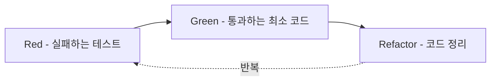
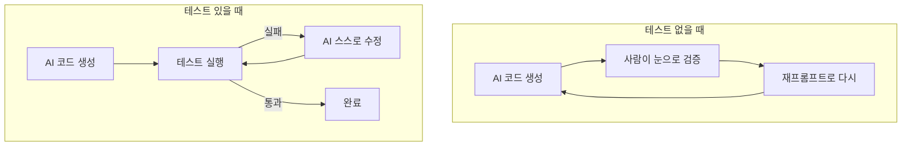

## 1. 들어가며

솔직히 나는 "테스트를 먼저 짠다"는 말을 시간 낭비라고 생각했다. 그런데 유튜브 쇼츠를 보다 멈칫했다 — "TDD를 쓰면 AI 토큰도 아끼고, AI가 스스로 코드를 검증하면서 고쳐나간다."

요즘 나는 AI 에이전트로 코딩하는 일이 많아서 이 말이 솔깃했다. 그래서 이번 프로젝트는 처음부터 TDD를 기본 방식으로 가져가기로 했다. 이 글은 그 개념 정리 + 도입 이유의 기록이다.

> 💬 미리 밝혀둘 것: "토큰을 아낀다 / AI가 스스로 검증한다"는 내 경험과 판단이지, 공식적으로 측정된 사실이 아니다. 개념 설명과 내 의견은 아래에서 구분해서 쓴다.

## 2. 📚 TDD란 무엇인가 (개념)

TDD(Test-Driven Development, 테스트 주도 개발) 는 Martin Fowler의 정의에 따르면 "테스트를 작성함으로써 소프트웨어 개발을 이끄는 기법"이다.[1] Kent Beck이 1990년대 후반 익스트림 프로그래밍(XP)의 일부로 정립했다.[1]

순서가 일반적인 개발과 거꾸로다. `코드 먼저 → 테스트 나중`이 아니라, 실패하는 테스트를 먼저 쓰고 → 통과시키는 코드를 쓴다.

### 🔁 Red - Green - Refactor



| 단계 | 하는 일 |
|------|--------|
| 🔴 Red (실패) | 추가할 기능에 대한 테스트를 먼저 쓴다 (아직 코드가 없으니 실패) |
| 🟢 Green (통과) | 테스트를 통과시키는 코드를 쓴다 |
| 🔵 Refactor (정리) | 새 코드·기존 코드를 잘 정리한다 |

> 💡 Fowler는 "TDD를 망치는 가장 흔한 방법은 세 번째 단계(Refactor)를 빼먹는 것"이라고 경고한다.[1] Kent Beck의 표현으로는 "Make it run, then make it right" — 일단 통과시키고, 그다음에 바르게 만든다.[2]

핵심은 테스트 커버리지 숫자가 아니다. "무엇이 맞는 동작인가"를 코드보다 먼저 명세로 고정하는 것이다.

## 3. 🤔 왜 이번 프로젝트에 도입했나 (내 판단)

이번 프로젝트의 도메인 로직 상당수는 입력과 출력이 명확한 순수 함수다. 예를 들어 "이 역할의 사용자가 이 작업을 할 수 있는가?"는 같은 입력이면 항상 같은 결과가 나온다. 이런 로직은 "입력 X → 출력 Y" 형태로 테스트가 자연스럽게 떨어져서 TDD에 잘 맞는다.

그리고 여기서 쇼츠의 그 말이 연결됐다. 테스트는 AI에게 주는 "반박 불가능한 정답지"다. "기능 만들어줘"라고 하면 AI는 내가 원하는 걸 추측하고, 빗나가면 다시 설명하는 왕복이 생긴다. 그 왕복이 전부 토큰이다. 하지만 테스트를 먼저 주면 AI는 추측 대신 "이 테스트를 통과시킨다" 하나만 목표로 삼는다.



내 경험상, 내가 "틀렸어, 다시"를 일일이 입력하는 횟수가 줄었다. (반복: 이건 측정값이 아니라 체감이다.)

## 4. 🆚 "테스트 나중에" vs "테스트 먼저"

| | 코드 먼저 → 테스트 나중 | TDD (테스트 먼저) |
|---|---|---|
| 명세 | 머릿속/문서에만 존재 | 테스트가 곧 실행 가능한 명세 |
| 회귀 발견 | 나중에, 운 좋으면 | 고치는 즉시 빨강으로 |
| AI 협업 | 사람이 결과를 눈으로 검증 | 테스트가 자동 검증 → AI가 스스로 반복 |
| 위험 | 통과만 보고 안심 | Refactor 빼먹으면 코드가 지저분 [1] |

## 5. 🧪 실제로 어떻게 적용했나 (코드는 일부만 🔒)

방식은 단순하다 — 테스트 케이스를 표로 먼저 설계 → JUnit으로 옮기기.

예를 들어 권한 정책은 역할 × 소유 여부 × 작업 타입의 경우의 수 매트릭스다. 이 표를 그대로 @ParameterizedTest(같은 테스트를 여러 인자로 반복 실행)로 옮겼다. 케이스는 수십 개지만, 보안상 규칙 전체는 공개하지 않고 패턴만 보인다.

```java
// .../XxxPermissionPolicyTest.java (대표 일부 발췌)
@ParameterizedTest
@MethodSource("cases")
void canDo(Role role, /* ... */ boolean expected) {
    assertThat(policy.canDo(role, /* ... */)).isEqualTo(expected);
}

static Stream<Arguments> cases() {
    return Stream.of(
        arguments(BUYER, /* 일반 작업 */, true),
        arguments(BUYER, /* 관리 작업 */, false),
        arguments(GUEST, /* 무엇이든 */,  false)
        // …(나머지 규칙은 비공개)
    );
}
```

표를 테스트로 옮기니 좋은 점이 있었다 — 빠진 칸(아직 정의 안 한 케이스)이 바로 드러났다. 머릿속으로 "다 처리했겠지" 하던 것들이 가시화된다.

> 🔒 문자열 필터링 로직도 같은 방식(케이스를 표로 → 파라미터화)으로 수십 개를 깔았다. 사전 단어나 우회 패턴은 공개하지 않는다.

## 6. ⭐ TDD가 실제로 잡아낸 버그 (하이라이트)

이게 내가 TDD에 확신을 가진 결정적 순간이다.

한 필터 로직에서 토큰을 소문자로 정규화하려고 자바 기본 String.toLowerCase()를 썼다. 그런데 터키어 İ(U+0130, 점 있는 대문자 I)가 소문자화되면서 글자 수가 늘어났다. 그 결과 문자열 인덱스가 원본과 어긋나 StringIndexOutOfBoundsException으로 터졌다.

```
원본 토큰:  İ  f  u  c  k      길이 5
            ↑ span [0..1] 매칭
toLowerCase: i̇  f  u  c  k     'İ' → 2글자로 늘어남, 길이 6
            └┬┘
          인덱스 어긋남 → StringIndexOutOfBounds 💥
```

알고 보니 이건 자바 공식 문서(Javadoc)에도 명시된 함정이었다. toLowerCase()는 locale sensitive 하며 의도치 않은 결과를 낼 수 있으니, 리터럴하게 다뤄야 하는 문자열엔 toLowerCase(Locale.ROOT) 사용을 권한다고 돼 있다. 문서는 터키어 예시와 함께 변환 후 길이가 달라질 수 있음을 표로 보여준다.

> ✅ 교훈: 정상 입력("안녕하세요")만 테스트했다면 절대 못 봤을 버그다. "이상한 유니코드 입력"을 테스트로 박아둔 덕에 실서비스 크래시를 사전에 막았다.

해결은 로케일에 의존하지 않는 길이 보존 방식의 ASCII 전용 소문자화로 교체. (어차피 사전이 한국어 + ASCII 영어뿐이라 충분했다.)

## 7. ⚖️ 솔직한 트레이드오프

TDD는 만능이 아니다.

- 순수 로직엔 강하지만, 외부 연동·네트워크 핸들러 같은 I/O 경계는 단위 TDD로 다 못 덮는다 — 통합 테스트의 영역이다.
- 그래서 나는 도메인 순수 로직엔 TDD를 엄격히 적용하고, I/O 계층은 분리했다.
- 테스트 자체가 틀리면 AI는 틀린 정답지를 향해 열심히 달려간다. 결국 테스트 품질 = 결과 품질이다.

> 즉 "어디에 TDD를 쓸지 고르는 것" 자체가 하나의 설계 결정이다.

## 8. ✨ 정리

- TDD = 🔴 실패 테스트 먼저 → 🟢 통과 코드 → 🔵 리팩터링의 반복 [1]
- 순수 로직(권한·필터 등)은 입출력이 명확해 TDD에 이상적이었다
- 내 체감: 테스트가 AI에게 명확한 정답지를 줘서 자가 검증·반복이 돌고, 교정 왕복이 줄었다 (측정값 아님)
- TDD가 실제 크래시 버그(터키어 İ)를 사전에 잡았다 — 자바 문서가 경고한 함정이었다
- 단, I/O 경계는 TDD 밖, 테스트 품질이 곧 코드 품질

### 📎 References

- [1] Martin Fowler, Test Driven Development (bliki) — https://martinfowler.com/bliki/TestDrivenDevelopment.html
- [2] Kent Beck, Test-Driven Development: By Example (2002)

